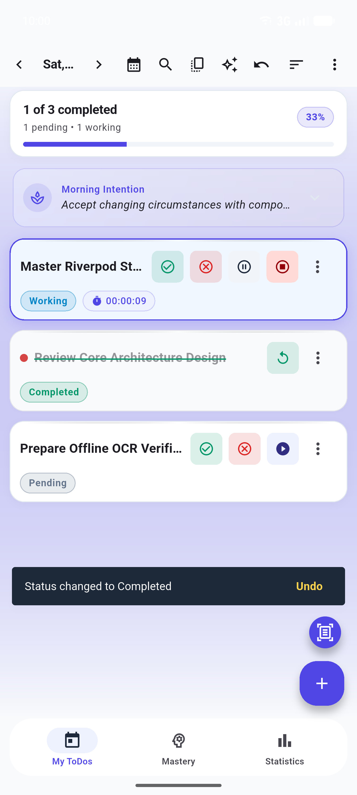
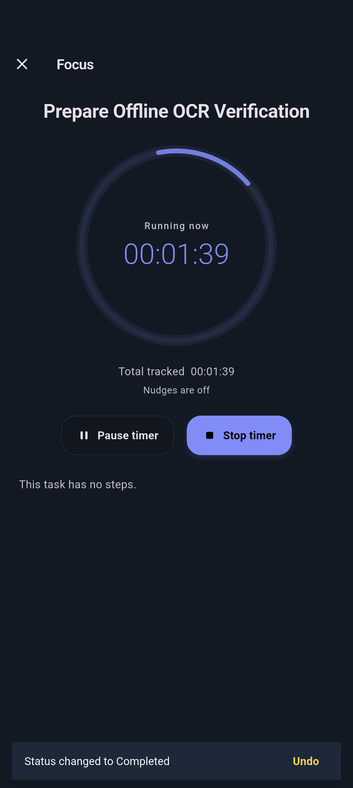
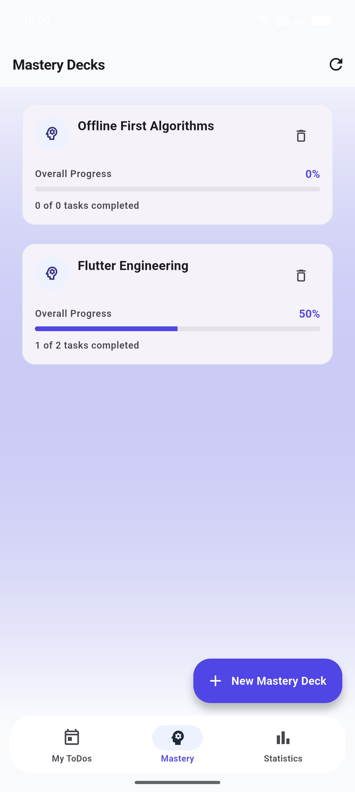
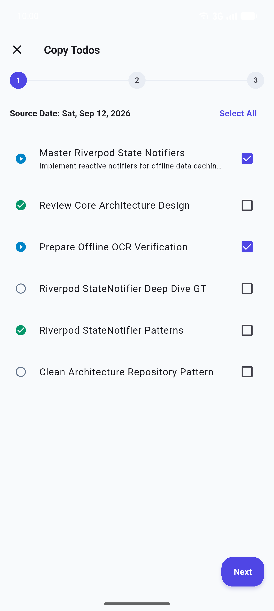
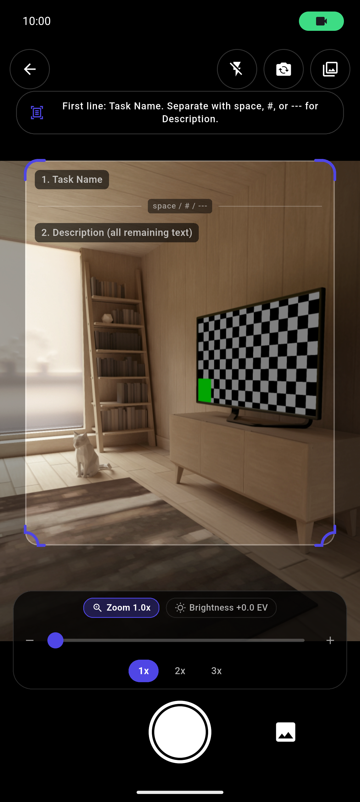
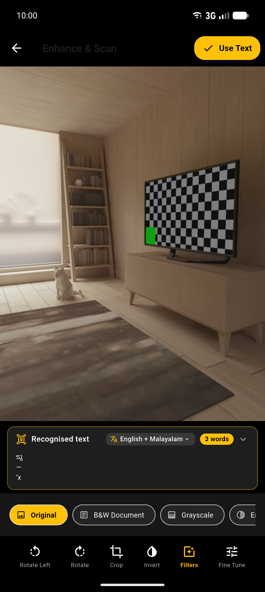
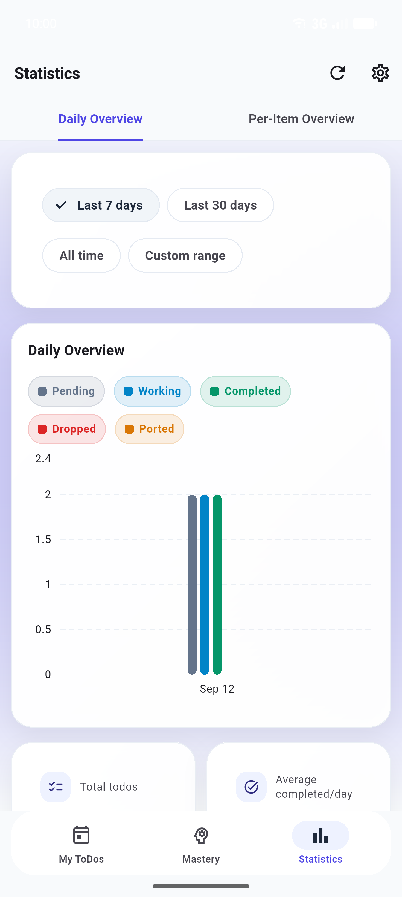
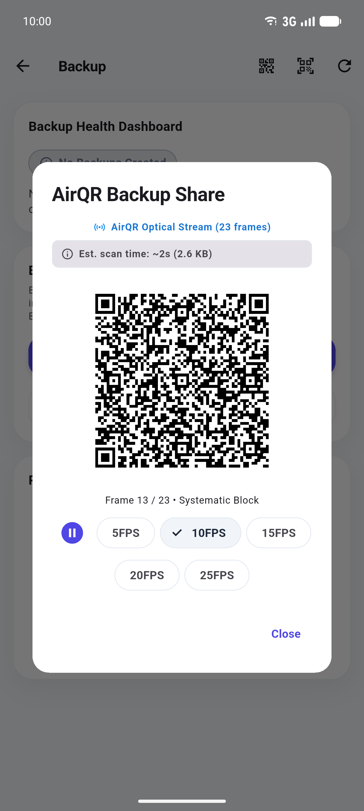
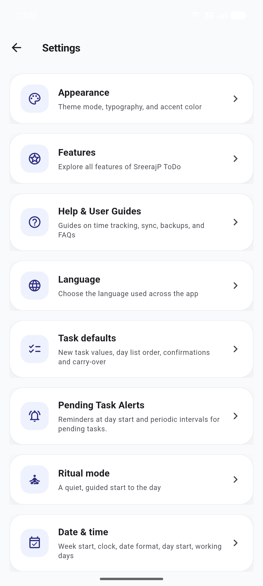

<div align="center">


# SreerajP ToDo

**A personal, privacy-first, fully offline daily ToDo and time-tracking system built with Flutter.**

[](#supported-platforms)
[](pubspec.yaml)
[](pubspec.yaml)
[](#offline-guarantee--security-architecture)
[](#offline-guarantee--security-architecture)
[](LICENSE)

*Every piece of data stays strictly on your device — zero accounts, zero cloud servers, zero analytics, and zero internet permission.*

</div>

---

## Table of Contents

- [Overview](#overview)
- [Key Highlights](#key-highlights)
- [App Showcase](#app-showcase)
- [Installation](#installation)
- [Build Instructions](#build-instructions)
- [Offline Guarantee & Security Architecture](#offline-guarantee--security-architecture)
- [Features at a Glance](#features-at-a-glance)
- [Feature Tour](#feature-tour)
  - [Daily Task List & Progress Header](#daily-task-list--progress-header)
  - [Creating and Editing Tasks](#creating-and-editing-tasks)
  - [Task Statuses and Terminal Flow](#task-statuses-and-terminal-flow)
  - [Sub-Tasks and Checklist Dependencies](#sub-tasks-and-checklist-dependencies)
  - [Spaced Repetition Task Mastery Deck](#spaced-repetition-task-mastery-deck)
  - [Daily Mindful Intention and Reflection](#daily-mindful-intention-and-reflection)
  - [Distraction-Free Focus Mode](#distraction-free-focus-mode)
  - [On-Device Offline OCR Task Scanner](#on-device-offline-ocr-task-scanner)
  - [Bilingual Voice Task Parser](#bilingual-voice-task-parser)
  - [Time Tracking and Live Multi-Timers](#time-tracking-and-live-multi-timers)
  - [Manual Time Entry & Overlap Validation](#manual-time-entry--overlap-validation)
  - [Background Notifications & Scheduled Alarms](#background-notifications--scheduled-alarms)
  - [Undo Safety & Persistent History](#undo-safety--persistent-history)
  - [Day Lock (Past Days Are Read-Only)](#day-lock-past-days-are-read-only)
  - [Copy and Port Workflows](#copy-and-port-workflows)
  - [Recurring Tasks (RFC 5545 RRULE)](#recurring-tasks-rfc-5545-rrule)
  - [Bulk Operations](#bulk-operations)
  - [FTS5 Search and Indic Phonetic Search](#fts5-search-and-indic-phonetic-search)
  - [Title Autocomplete](#title-autocomplete)
  - [Productivity Statistics Dashboard](#productivity-statistics-dashboard)
  - [Air-QR Optical Transfer & Local Wi-Fi Sync](#air-qr-optical-transfer--local-wi-fi-sync)
  - [Multi-Format Data Handoff (Markdown & JSON)](#multi-format-data-handoff-markdown--json)
- [Technical Architecture](#technical-architecture)
- [Data Storage & Encrypted Backups](#data-storage--encrypted-backups)
- [Permissions Transparency](#permissions-transparency)
  - [Permissions the App Uses](#permissions-the-app-uses)
  - [Permissions the App Does NOT Have](#permissions-the-app-does-not-have)
- [Unicode and Language Support](#unicode-and-language-support)
- [Supported Platforms](#supported-platforms)
- [App Screens & Route Map](#app-screens--route-map)
- [Privacy and Security](#privacy-and-security)
- [License](#license)

---

## Overview

**SreerajP ToDo** is a personal daily planner and time-tracking application built for people who value privacy, discipline, and complete data ownership.

Most modern task apps push your personal schedule, thoughts, and habits into external cloud databases. SreerajP ToDo takes the opposite path:
- **100% Offline by Design:** The app operates completely without internet connectivity. Outbound network requests are physically blocked at the OS level because the app does not request or hold network permissions.
- **Strict Historical Integrity:** The unique **Day Lock** rule ensures that once a day passes, its records are permanently sealed. You cannot rewrite history, giving you an honest, reliable log of your time and achievements.
- **Deep Productivity Features:** Includes live multi-timer tracking, distraction-free focus sessions, an on-device OCR paper scanner, hands-free bilingual voice parsing, SM-2 spaced repetition mastery decks, and mindful daily rituals.
- **Zero-Cloud Data Portability:** Seamlessly move your data between your devices using optical **Air-QR** scanning or direct peer-to-peer local Wi-Fi transfer without a single byte ever touching a remote server.

---

## Key Highlights

- 🔒 **100% Offline & Zero Telemetry:** No accounts, no cloud sync, no tracking, and no third-party analytics.
- 🛡️ **Hardware-Backed AES-256 Encryption:** Database encrypted at rest using SQLCipher with keys protected by Android Keystore or Windows DPAPI.
- ⏱️ **Live Multi-Timers & Accurate Tracking:** Run live timers on multiple active tasks simultaneously or record manual intervals with automatic overlap validation.
- 🔐 **Strict Day Lock & Terminal Discipline:** Past calendar days are locked as read-only. Terminal tasks (completed or dropped) cannot run active timers.
- 📷 **On-Device Offline OCR Scanner:** Scan paper checklists and notes directly into structured tasks with built-in crop, rotate, and contrast adjustment tools.
- 🎙️ **Bilingual Voice Task Parser:** Speak tasks hands-free in English or Malayalam (`മലയാളം`) to extract titles, descriptions, dates, and target durations locally.
- 🧠 **Spaced Repetition Mastery Deck:** Apply the SM-2 scientific retention algorithm to recurring study topics, habits, or periodic maintenance items.
- 🧘 **Mindful Daily Rituals:** Start your day with a focused morning intention and close it with an evening reflection journal.
- 🎯 **Distraction-Free Focus Mode:** Single-task full-screen workspace with radial progress countdowns and quick play/pause controls.
- 🔁 **Air-Gapped Optical & Local Sync:** Transfer encrypted database snapshots between devices via animated **Air-QR** codes or direct local Wi-Fi sockets.
- 🔍 **SQLite FTS5 & Indic Phonetic Search:** Instant search across all historical tasks with Malayalam phonetic sandhi matching.
- 📝 **Multi-Format Data Handoff:** Export your daily task lists into clean Markdown (ready for Obsidian or Logseq) or structured JSON.
- 🌐 **Full Bilingual Localization:** Complete interface available in English and Malayalam with automatic RTL/LTR script detection.

---

## App Showcase

<div align="center">

| Daily Task List | Distraction-Free Focus Mode | Spaced Repetition Mastery Deck |
| :---: | :---: | :---: |
|  |  |  |

| Guided Daily Ritual | On-Device OCR Scanner | OCR Crop & Document Editor |
| :---: | :---: | :---: |
|  |  |  |

| Productivity Statistics | Encrypted Backup & Air-QR | Settings & Preferences Hub |
| :---: | :---: | :---: |
|  |  |  |

</div>

> [!TIP]
> For detailed instructions on capturing, formatting, and contributing screenshots, see the [Screenshots Guide](docs/screenshots/README.md).

---

## Installation

### Android

1. Download the release APK (`app-prod-release.apk` or `app-release.apk`).
2. Sideload the APK onto your Android device (Android 5.0 / API 21 or higher).
3. If prompted by Android, grant permission to "Install unknown apps" for your file manager or browser.
4. Launch the app. You can safely turn on Airplane Mode to confirm that every feature operates 100% offline.

### Windows Desktop

1. Copy the portable release folder `build/windows/x64/runner/Release/` to your target Windows 10/11 PC.
2. Ensure all folder dependencies remain together (including `sreerajp_todo.exe` and `sqlite3.dll`).
3. Launch `sreerajp_todo.exe`.

---

## Build Instructions

### Prerequisites

- Flutter SDK `3.44.8` stable
- Dart SDK `3.12.2`
- Android SDK (targetSdk 34, minSdk 21)
- Windows 10/11 with C++ Desktop Workload (Visual Studio 2022) for Windows builds

### Android Build

```powershell
# Get dependencies
flutter pub get

# Daily development (dev flavor)
flutter run --flavor dev

# Production split APKs (per ABI)
flutter build apk --flavor prod --release --obfuscate --split-debug-info=build/symbols/android-prod/ --split-per-abi

# Production Google Play App Bundle
flutter build appbundle --flavor prod --release --obfuscate --split-debug-info=build/symbols/android-prod/
```

### Windows Desktop Build

```powershell
flutter pub get
.\tool\refresh_build_metadata.ps1
flutter build windows --release
```

### Code Quality & Offline Verification

```powershell
# Format code
dart format lib/ test/ integration_test/

# Static analysis (must have 0 warnings or errors)
flutter analyze

# Run unit, DAO, and widget tests
flutter test

# Offline compliance audit (ensures zero networking libraries exist)
flutter pub deps --json | Select-String -Pattern "http|socket|firebase|supabase|sentry|crashlytics|analytics|dio|chopper|retrofit|amplitude|mixpanel|datadog"
```

For release signing and key configuration, refer to [docs/release_process.md](docs/release_process.md).

---

## Offline Guarantee & Security Architecture

SreerajP ToDo operates under an uncompromising privacy and security model:

```text
+-------------------------------------------------------------------------+
|                              DEVICE SANDBOX                             |
|                                                                         |
|  +--------------------+   +---------------------+   +----------------+  |
|  |  Presentation & UI |   | On-Device ML Kit    |   |  Local Speech  |  |
|  |  (Flutter Widgets) |   | (Offline OCR Engine)|   |  Recognizer    |  |
|  +---------+----------+   +----------+----------+   +--------+-------+  |
|            |                         |                       |          |
|            v                         v                       v          |
|  +-------------------------------------------------------------------+  |
|  |             Application State & Domain Logic (Riverpod)           |  |
|  +-----------------------------------+-------------------------------+  |
|                                      |                                  |
|                                      v                                  |
|  +-------------------------------------------------------------------+  |
|  |              Data Layer & Unicode NFC Normalizer                  |  |
|  +-----------------------------------+-------------------------------+  |
|                                      |                                  |
|                                      v                                  |
|  +-------------------------------------------------------------------+  |
|  |      SQLCipher Encrypted SQLite Database (AES-256 Encryption)     |  |
|  |     Keys secured in Android Keystore / Windows DPAPI at Rest      |  |
|  +-------------------------------------------------------------------+  |
|                                                                         |
|  [X] ZERO INTERNET PERMISSION IN MANIFEST (OS KERNEL BLOCKS NETWORKING)  |
+-------------------------------------------------------------------------+
```

1. **Zero Internet Permission:** `AndroidManifest.xml` does not include `android.permission.INTERNET`, `ACCESS_NETWORK_STATE`, or `ACCESS_WIFI_STATE`. Even if third-party code attempted a network connection, the operating system kernel rejects it outright.
2. **100% On-Device Processing:** Text recognition (Google ML Kit) and voice task parsing run locally on your device hardware without transmitting audio or images to remote APIs.
3. **Dual-Key Cryptography:**
   - **Live Database:** Encrypted at rest using AES-256 SQLCipher. The database encryption key is generated on the first run and stored securely in the hardware-backed Android Keystore or Windows DPAPI.
   - **User Backups:** Exported backup files are encrypted with an 8+ character user passphrase using AES-256 ZIP encryption.
4. **Air-Gapped Transfers:** You can synchronize records across devices without network infrastructure using optical animated **Air-QR** streams or direct peer-to-peer Wi-Fi sockets on your home router.

---

## Features at a Glance

| Feature | Description |
|---|---|
| **Daily Task List** | Daily planning with completion progress indicators, timers, and drag-and-drop reordering |
| **Task Statuses** | Four discrete statuses: Pending, Completed, Dropped, and Ported |
| **Sub-Tasks & Dependencies** | Break tasks into checklist items and enforce prerequisite blocker completion |
| **Spaced Repetition Deck** | Scientific SM-2 spaced repetition engine for long-term retention and habit review |
| **Mindful Daily Ritual** | Set a morning intention and write an evening reflection journal |
| **Distraction-Free Focus** | Full-screen focus mode with visual countdown timers and progress pulses |
| **Offline OCR Scanner** | Scan paper lists using camera recognition with built-in crop, rotate, and contrast tools |
| **Bilingual Voice Parser** | Hands-free task creation with date and duration parsing in English and Malayalam |
| **Time Tracking** | Start/stop live multi-timers or log manual time entries with overlap validation |
| **Background Notifications** | Persistent status-bar timers and exact scheduled alarms for pending tasks |
| **Strict Day Lock** | Past calendar dates are read-only to guarantee historical integrity |
| **Undo Safety** | 5-second SnackBar undo and persistent 5-step undo history in the top app bar |
| **Recurring Tasks** | Flexible recurring schedules (Daily, Weekly, Monthly, Yearly) via RFC 5545 RRULE |
| **Copy & Port** | Duplicate tasks forward or port unfinished items to future dates |
| **FTS5 & Phonetic Search** | SQLite FTS5 full-text indexing with Indic phonetic sandhi support |
| **Title Autocomplete** | Suggests past task titles as you type to prevent duplicate naming |
| **Statistics Dashboard** | Daily completion breakdowns, per-item historical trends, and sunk-time analytics |
| **Air-QR & Wi-Fi Sync** | Optical transfer via animated QR codes or local peer-to-peer Wi-Fi sockets |
| **Multi-Format Handoff** | Export selected dates as clean Markdown documents or JSON archives |
| **Unicode & Bilingual Polish** | Full English and Malayalam localization with automatic RTL/LTR script detection |

---

## Feature Tour

### Daily Task List & Progress Header

When you open the app, you are presented with today's task list:
- **Daily Progress Header:** Displays total tasks, completion percentage, and cumulative work time tracked today.
- **Interactive Task Tiles:** Each tile shows task title, target duration, accumulated time, status badge, and quick-action buttons. Tapping any tile expands its description.
- **Start/Stop Controls:** Pending tasks feature one-tap timer controls to record work intervals.
- **Day Navigation:** Use arrow buttons, the calendar picker, or the "Today" button to jump between past, present, and future dates.
- **Drag-and-Drop Reordering:** Reorder tasks directly to organize your priority for the day.

### Creating and Editing Tasks

Tap the **Floating Action Button (+)** or use voice and OCR shortcuts to create tasks:
- **Title Field:** Required. Offers autocomplete suggestions based on historical task titles and warns if a duplicate title exists on the same day.
- **Description:** Optional notes or context for the task.
- **Target Duration:** Optional goal in hours and minutes with real-time two-digit validation.
- **Sub-Tasks & Dependencies:** Add checklist items or link prerequisite blocker tasks.

### Task Statuses and Terminal Flow

| Status | Meaning | Behaviour |
|---|---|---|
| **Pending** | Active / To Do | Default status. Live timers run freely; all fields can be edited. |
| **Completed** | Finished | Running timer stops immediately. New time entries are locked. |
| **Dropped** | Abandoned | Timer stops. Time spent is categorized as "dropped/sunk time" in statistics. |
| **Ported** | Moved forward | Original task is marked ported; an active duplicate is created on the target date. |

Marking a task **Completed**, **Dropped**, or **Ported** permanently locks further time tracking. Dropping or porting requires user confirmation to prevent accidental taps.

### Sub-Tasks and Checklist Dependencies

- **Sub-Task Checklists:** Break down complex items into smaller sub-tasks with real-time completion progress.
- **Prerequisite Dependencies:** Link tasks so that dependent items visually indicate blockers until prerequisite tasks are completed.

### Spaced Repetition Task Mastery Deck

The **Mastery Deck** applies the scientific SM-2 spaced repetition algorithm to task management:
- Create review cards for study topics, personal habits, books, or recurring maintenance checklists.
- Rate your recall or performance using standard SM-2 grading (Again, Hard, Good, Easy).
- The scheduling engine computes optimal review intervals (1 day, 6 days, and exponential increments) and automatically generates daily review tasks on your list.
- Group mastery items by tags and view detailed review logs for each deck item.

### Daily Mindful Intention and Reflection

Anchor your daily routine with mindful reflection:
- **Morning Intention:** Set a core intention or focal theme for the day ahead.
- **Evening Reflection:** Review achievements, note areas for improvement, and record personal gratitude.
- Entries are preserved in your local journal and accessible on the calendar view.

### Distraction-Free Focus Mode

Tap the **Focus** button on any pending task to enter full-screen focus mode:
- Clean, distraction-free radial countdown timer displaying progress toward your target duration.
- Large play/pause controls and single-tap task completion.
- Keeps your focus locked onto one task at a time.

### On-Device Offline OCR Task Scanner

Capture physical task notes from paper, notebooks, whiteboards, or printed sheets:
- Uses on-device Google ML Kit text recognition without sending images or data to any cloud service.
- **Post-Capture Document Editor:** Built-in tools let you **crop**, **rotate**, and adjust **contrast and brightness** to ensure optimal recognition accuracy.
- Intelligently parses checkboxes, bullet points, and numbered lists into structured task titles and descriptions.

### Bilingual Voice Task Parser

Create tasks hands-free using natural spoken commands:
- Processes speech recognition entirely on-device in **English** and **Malayalam** (`മലയാളം`).
- Parses natural spoken language to extract task titles, optional descriptions, scheduled dates ("tomorrow", "next Monday"), and target durations ("for 45 minutes", "2 hours").

### Time Tracking and Live Multi-Timers

- **Multi-Timer Support:** Run live timers on multiple active tasks simultaneously (e.g. running an export job while tracking research).
- **Crash Resilience:** If your device reboots or the app is killed while a timer is active, the app safely recovers the segment on relaunch.
- **Time Segments Screen:** View individual time intervals, exact start/stop timestamps, and calculated segment durations.

### Manual Time Entry & Overlap Validation

Forgot to start a timer? Add time segments manually:
1. Open the **Time Segments** view for any task.
2. Tap **Add Manual Segment**.
3. Select start and end times. The system validates against existing segments to prevent overlaps.
4. Manually entered segments are transparently badged with an **"M"** indicator.

### Background Notifications & Scheduled Alarms

- **Persistent Status Bar Timer:** Keeps active timers visible in your notification drawer with elapsed duration updates.
- **Exact Task Alarms:** Schedules exact background alarms for pending task reminders using `SCHEDULE_EXACT_ALARM`, ensuring you never miss time-sensitive tasks even when the device is idle.
- **Boot Restoration:** Automatically reschedules active alarms after device reboots via `RECEIVE_BOOT_COMPLETED`.

### Undo Safety & Persistent History

- **5-Second SnackBar:** Instant single-tap undo appears immediately after any status change.
- **Persistent App Bar Undo (↩):** Stores a 5-step undo history for up to 2 minutes, allowing you to revert changes even after the SnackBar dismisses.

### Day Lock (Past Days Are Read-Only)

Any task dated **before today** is permanently locked:
- Titles, descriptions, and statuses cannot be modified.
- Timers cannot be started, and manual segments cannot be added.
- A padlock icon marks locked items.
- Preserves the authenticity of your historical productivity logs.

### Copy and Port Workflows

- **Copy:** Duplicates tasks to any future date as fresh pending items while keeping the original intact.
- **Port:** Atomically moves an incomplete task forward. The original is marked as "Ported" with a link to the target date, and a fresh copy is created on the destination date.

### Recurring Tasks (RFC 5545 RRULE)

Automate recurring schedules using standard RFC 5545 RRULE expressions:
- Flexible intervals: Daily, Weekly (selected weekdays), Monthly (by date or day-of-week), and Yearly.
- Automatically generates recurring tasks for the upcoming week upon app launch.
- Duplicate prevention guarantees that recurring tasks are never created twice for the same day.

### Bulk Operations

Long-press any task to enter multi-select mode:
- Complete, drop, or copy multiple tasks in a single atomic database transaction.
- Single-tap batch undo reverts the entire multi-task operation instantly.

### FTS5 Search and Indic Phonetic Search

- **SQLite FTS5 Index:** High-speed full-text search across all tasks, descriptions, and historical records.
- **Indic Phonetic & Sandhi Matching:** Accommodates Malayalam orthographic variations and phonetic equivalents to ensure accurate search results.

### Title Autocomplete

Autocomplete suggests past task titles as you type, maintaining consistent naming conventions and speeding up daily entry.

### Productivity Statistics Dashboard

- **Daily Overview:** Visual breakdown of completed, dropped, ported, and pending tasks alongside paginated daily summary tables.
- **Per-Item Trends:** Line charts showing historical time spent on specific recurring task titles over time.
- **Productive vs. Sunk Time:** Separates time invested in completed tasks from time spent on dropped tasks.

### Air-QR Optical Transfer & Local Wi-Fi Sync

Transfer your data between devices without internet access:
- **Air-QR Optical Transfer:** Encodes encrypted backup archives into a sequence of animated, high-density QR codes displayed on screen and scanned using the receiving device's camera.
- **Local Wi-Fi Sync:** Establishes a direct peer-to-peer TCP socket between two devices on the same local Wi-Fi network.

### Multi-Format Data Handoff (Markdown & JSON)

Export your daily records in standard open formats:
- **Markdown Export:** Generates clean daily log notes with checklists and timestamps, ready for note-taking systems like Obsidian or Logseq.
- **JSON Export:** Structured JSON schema for spreadsheets, custom scripts, and personal data archives.

---

## Technical Architecture

The application follows a clean 5-layer architecture with strict unidirectional dependencies:

```text
lib/
|-- presentation/    # Flutter UI widgets, screens, controllers, theme
|-- application/     # Riverpod StateNotifier providers & screen state
|-- domain/          # Pure Dart entities, repository interfaces, use cases
|-- data/            # Repository implementations, DAOs, migrations, services
`-- core/            # Constants, utilities, Unicode tools, voice lexicons
```

| Layer | Technology | Responsibility |
|---|---|---|
| **Presentation** | Flutter 3.44.8 / Material 3 | Responsive UI screens, custom painters, and dialogs |
| **State Management** | Riverpod (`flutter_riverpod`) | Reactive state management and dependency injection |
| **Domain** | Freezed / Pure Dart | Immutable entities, value objects, and business rules |
| **Database** | SQLCipher (`sqflite_sqlcipher`) | AES-256 encrypted SQLite with WAL mode and foreign keys |
| **Search Engine** | SQLite FTS5 | Full-text indexing with Indic phonetic search rules |
| **Key Storage** | Android Keystore / Windows DPAPI | Secure storage for database encryption keys at rest |
| **Text Recognition** | Google ML Kit (On-Device) | Offline OCR document scanning without cloud calls |
| **Voice Parsing** | Speech-to-Text & Custom Lexicons | Bilingual voice task parsing for English and Malayalam |
| **Recurrence** | `rrule` (RFC 5545) | Rule-based recurring task scheduling |

---

## Data Storage & Encrypted Backups

- **Local SQLite Database:** All task data resides in `sreerajp_todo.db` in your device's private sandbox.
- **Hardware-Protected Master Key:** The database key is generated on the initial launch and protected by the Android Keystore (or Windows DPAPI).
- **Passphrase-Protected Backups:** When exporting a backup, you provide an 8+ character passphrase. The backup archive is encrypted using AES-256 ZIP encryption.
- **Safe Restoration:** Backup restoration performs schema validation and version checks before replacing the database.
- **Backup Health Dashboard:** Monitors backup recency and warns if backups are overdue.

---

## Permissions Transparency

### Permissions the App Uses

| Permission | Platform | Purpose |
|---|---|---|
| `android.permission.CAMERA` | Android | Used strictly for scanning optical Air-QR transfer codes and capturing paper notes in the Offline OCR Scanner. Camera feeds never leave the device. |
| `android.permission.RECORD_AUDIO` | Android | Used strictly for the on-device Bilingual Voice Task Parser when triggered by the user. Audio is processed locally and never recorded or sent off-device. |
| `android.permission.POST_NOTIFICATIONS` | Android | Displays the ongoing live timer notification and alerts for pending tasks. |
| `android.permission.SCHEDULE_EXACT_ALARM` | Android | Schedules precise background reminder alarms for pending tasks. |
| `android.permission.RECEIVE_BOOT_COMPLETED` | Android | Reschedules active pending task alarms when the device reboots. |
| File Storage / Picker | Android, Windows | Standard OS file dialogs to choose backup export and import locations. |

### Permissions the App Does NOT Have

The application **deliberately omits** all network and privacy-invasive permissions:

| Permission | Status | Rationale |
|---|---|---|
| `android.permission.INTERNET` | **ABSENT** | The app never connects to the internet. The OS blocks all socket and HTTP traffic. |
| `android.permission.ACCESS_NETWORK_STATE` | **ABSENT** | The app does not monitor network connectivity status. |
| `android.permission.ACCESS_WIFI_STATE` | **ABSENT** | The app does not inspect Wi-Fi state. |
| Location Permissions | **ABSENT** | Zero location tracking or GPS access. |
| Contacts Permissions | **ABSENT** | Zero address book access. |
| Phone / SMS Permissions | **ABSENT** | Zero telephony or messaging access. |

---

## Unicode and Language Support

- **Bilingual Interface:** Full localization in **English** and **Malayalam** (`ml`). Switch languages in Settings or follow system defaults.
- **Unicode NFC Normalization:** All text written to the database is normalized to Unicode Normalization Form C (`unicodeUtils.nfcNormalize`), ensuring consistent search results and title uniqueness.
- **Bidirectional Script Support:** Automatic RTL/LTR detection ensures proper display for Arabic, Hebrew, Latin, and Indic scripts.

---

## Supported Platforms

| Platform | Status | Minimum OS Version |
|---|---|---|
| **Android** | Supported (Production) | Android 5.0 (API Level 21) |
| **Windows** | Supported (Production) | Windows 10 (x64) |
| iOS | Architecture Ready (Future) | — |
| Linux | Architecture Ready (Future) | — |
| macOS | Architecture Ready (Future) | — |

---

## App Screens & Route Map

All screens in SreerajP ToDo are mapped via `go_router` in [lib/core/constants/app_routes.dart](lib/core/constants/app_routes.dart):

| Screen | Route | Description |
|---|---|---|
| **Daily List** | `/` or `/day/:date` | Main daily task list with live timers, status badges, and progress overview |
| **Create Task** | `/todo/new` | Task creation with title autocomplete, duration goals, and sub-tasks |
| **Edit Task** | `/todo/:id` | Task editor for title, description, target duration, and sub-tasks |
| **Focus Mode** | `/focus/:id` | Full-screen distraction-free timer and task completion view |
| **Time Segments** | `/todo/:id/segments` | Detailed log of recorded time segments and manual time entry |
| **Task History** | `/todo/:id/history` | Audit timeline showing creation, copies, moves, and status transitions |
| **Task Mastery Deck** | `/mastery-deck` | Spaced repetition flashcards and review grading interface |
| **Mastery Deck Detail** | `/mastery-deck/:id` | Specific mastery deck item details, review history, and manual tasks |
| **Daily Mindful Ritual** | `/ritual` | Guided morning intention setting and evening reflection journal |
| **Ritual Deck** | `/ritual/deck` | Philosophical reflection prompt deck browser |
| **Offline OCR Scanner** | `/ocr-scan` | Camera document scanner with image crop, rotate, and contrast tools |
| **Voice Task Sheet** | Bottom Sheet | Hands-free bilingual voice parser for quick task creation |
| **Copy Tasks** | `/copy` | Multi-task duplication and copy wizard |
| **Search Results** | `/search` | FTS5 full-text and Indic phonetic sandhi search across all dates |
| **Productivity Statistics**| `/statistics` | Visual charts and paginated daily completion summaries |
| **Backup & Health** | `/backup` | Passphrase-encrypted backup export/import and health dashboard |
| **Air-QR Optical Scan** | `/air-qr-scan` | Camera scanner for optical air-gapped device transfers |
| **Local Wi-Fi Sync** | `/wifi-sync` | Offline peer-to-peer Wi-Fi synchronization |
| **Data Handoff** | `/data-handoff` | Markdown and JSON export for external note-taking tools |
| **Settings** | `/settings` | Appearance, time tracking, task defaults, language, and security settings |
| **About & Help** | `/about`, `/help` | Version metadata, build date, and interactive feature guide |

---

## Privacy and Security

- **100% Offline Guarantee:** Zero network requests, zero telemetry, zero analytics.
- **Zero Account Footprint:** No user accounts, registration, email collection, or advertising SDKs.
- **Hardware-Backed Cryptography:** SQLite database encrypted using AES-256 with keys stored in the Android Keystore or Windows DPAPI.
- **Encrypted Portable Backups:** Backups are user-encrypted archives protected by your chosen passphrase.
- **Local Sandbox Isolation:** All data stays isolated within your operating system's application sandbox.

---

## License

This project is licensed under the **MIT License** — see the [LICENSE](LICENSE) file for details.

Copyright (c) 2026 Sreeraj P.
