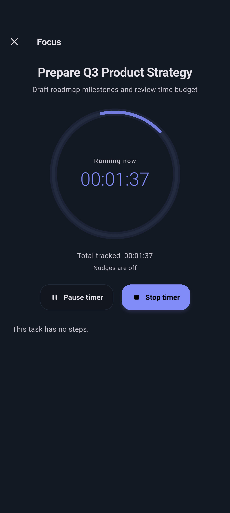
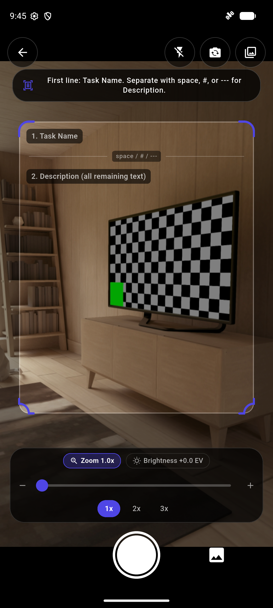

# SreerajP ToDo

A personal, fully offline daily ToDo and time-tracking app built with Flutter. Every piece of
data stays on your device — no accounts, no cloud, no analytics, zero internet required.

---

## Table of Contents

- [What This App Does](#what-this-app-does)
- [Screenshots](#screenshots)
- [Installation](#installation)
- [Build Instructions](#build-instructions)
- [Offline Guarantee & Security Architecture](#offline-guarantee--security-architecture)
- [Features at a Glance](#features-at-a-glance)
- [How the App Works](#how-the-app-works)
  - [Daily ToDo List & Progress Header](#daily-todo-list--progress-header)
  - [Creating and Editing Tasks](#creating-and-editing-tasks)
  - [Task Statuses and Flow](#task-statuses-and-flow)
  - [Sub-Tasks and Checklist Dependencies](#sub-tasks-and-checklist-dependencies)
  - [Spaced Repetition Task Mastery Deck](#spaced-repetition-task-mastery-deck)
  - [Daily Mindful Intention and Reflection](#daily-mindful-intention-and-reflection)
  - [Distraction-Free Focus Mode](#distraction-free-focus-mode)
  - [Offline OCR Task Scanner](#offline-ocr-task-scanner)
  - [Bilingual Voice Task Parser](#bilingual-voice-task-parser)
  - [Time Tracking and Live Timers](#time-tracking-and-live-timers)
  - [Manual Time Entry](#manual-time-entry)
  - [Undo After a Status Change](#undo-after-a-status-change)
  - [Day Lock (Past Days Are Read-Only)](#day-lock-past-days-are-read-only)
  - [Copy and Port](#copy-and-port)
  - [Recurring Tasks (RFC 5545 RRULE)](#recurring-tasks-rfc-5545-rrule)
  - [Bulk Operations](#bulk-operations)
  - [FTS5 Search and Indic Phonetic Search](#fts5-search-and-indic-phonetic-search)
  - [Title Autocomplete](#title-autocomplete)
  - [Statistics Dashboard](#statistics-dashboard)
  - [Air-QR Optical Transfer & Local Wi-Fi Sync](#air-qr-optical-transfer--local-wi-fi-sync)
  - [Multi-Format Data Handoff (Markdown & JSON)](#multi-format-data-handoff-markdown--json)
- [How the App Stores Data](#how-the-app-stores-data)
- [Exporting and Importing Data (Backup and Restore)](#exporting-and-importing-data-backup-and-restore)
- [Permissions](#permissions)
  - [Permissions the App Uses](#permissions-the-app-uses)
  - [Permissions the App Does NOT Have](#permissions-the-app-does-not-have)
- [Unicode and Language Support](#unicode-and-language-support)
- [Supported Platforms](#supported-platforms)
- [App Screens](#app-screens)
- [Privacy and Security](#privacy-and-security)
- [Known Limitations](#known-limitations)

---

## What This App Does

SreerajP ToDo is a personal daily planner and productivity tracker designed for individuals
who value privacy, focus, and data ownership:

- **Plan your day:** Organise tasks by calendar date with completion progress indicators.
- **Break down work:** Add sub-tasks with checklist progress and dependency blockers.
- **Track time accurately:** Measure work with live ongoing timers or manual time segments.
- **Build lasting habits & learn:** Revise items using a spaced repetition mastery deck.
- **Daily mindful rituals:** Set a morning intention and write an evening reflection.
- **Scan physical lists:** Capture printed or handwritten notes using the offline OCR scanner.
- **Speak your tasks:** Create structured tasks hands-free using bilingual voice parsing.
- **Zero cloud reliance:** Keep your database encrypted on your own device.
- **Device-to-device sharing without internet:** Transfer data using optical QR codes or
  direct local Wi-Fi peer-to-peer sync.

The app is **100% offline**. It has no user accounts, no tracking, and no external server
connections. You own and control every byte of your data.

---

## Screenshots

| Daily Task List | Focus Mode & Rituals | Spaced Repetition Mastery Deck |
| :---: | :---: | :---: |
|  |  |  |
| **OCR Scanner & Voice Parser** | **Statistics Dashboard** | **Encrypted Backup & Air-QR** |
|  |  |  |

> [!TIP]
> For instructions on capturing, formatting, and contributing screenshots, see the
> [Screenshots Guide](docs/screenshots/README.md).

---

## Installation

### Android

1. Download or build `app-release.apk` (or flavor build `app-prod-release.apk`).
2. Sideload the APK onto your Android device (Android 5.0 / API 21 or higher).
3. If prompted, enable "Install unknown apps" for your file manager.
4. Launch the app. Verify all features work completely in Airplane Mode.

### Windows

1. Copy the portable release folder `build/windows/x64/runner/Release/` to your PC.
2. Keep the folder files together (including `sreerajp_todo.exe` and `sqlite3.dll`).
3. Run `sreerajp_todo.exe`.
4. Verify the app runs normally without any active internet connection.

---

## Build Instructions

### Prerequisites

- Flutter `3.44.8` stable
- Dart `3.12.2`
- Android SDK (targetSdk 34, minSdk 21)
- Windows 10/11 with C++ Desktop development tools (for Windows build)

### Android

```powershell
# Fetch dependencies
flutter pub get

# Daily development (dev flavor)
flutter run --flavor dev

# Production APK build
flutter build apk --flavor prod --release --obfuscate --split-debug-info=build/symbols/android-prod/ --split-per-abi

# Production Google Play App Bundle
flutter build appbundle --flavor prod --release --obfuscate --split-debug-info=build/symbols/android-prod/
```

### Windows Desktop

```powershell
flutter pub get
.\tool\refresh_build_metadata.ps1
flutter build windows --release
```

### Verification & Quality Checks

```powershell
# Format check
dart format lib/ test/ integration_test/

# Static code analysis (must have 0 issues)
flutter analyze

# Run unit and widget tests
flutter test

# Offline dependency audit (ensure no networking libraries exist)
flutter pub deps --json | Select-String -Pattern "http|socket|firebase|supabase|sentry|crashlytics|analytics|dio|chopper|retrofit|amplitude|mixpanel|datadog"
```

For release pipelines and signing key setup, see [docs/release_process.md](docs/release_process.md).

---

## Offline Guarantee & Security Architecture

SreerajP ToDo operates under a strict offline contract:

1. **Zero Internet Permission:** `AndroidManifest.xml` deliberately omits `INTERNET`,
   `ACCESS_NETWORK_STATE`, and `ACCESS_WIFI_STATE`. Even if an external library attempted
   an outbound network call, the operating system kernel blocks it immediately.
2. **On-Device Intelligence:** OCR text recognition (ML Kit) and voice task parsing run
   locally on the device hardware without sending images or audio clips to any remote API.
3. **Dual-Key AES-256 Encryption:**
   - **Live SQLite Database:** Encrypted at rest using SQLCipher with a 256-bit key protected
     by Android Keystore or Windows DPAPI.
   - **Backups:** Re-encrypted with a user-supplied passphrase, producing a portable AES-256
     archive.
4. **Air-Gapped Data Transfers:** Transfer data between devices without internet using optical
   Air-QR scanning (animated QR codes) or local peer-to-peer Wi-Fi sockets on the same LAN.

---

## Features at a Glance

| Feature | Description |
|---|---|
| **Daily Task List** | Daily task planning, status badges, live timers, and progress overview |
| **Task Statuses** | Four statuses: Pending, Completed, Dropped, and Ported |
| **Sub-Tasks & Dependencies** | Break tasks into checklist items and enforce prerequisite completion |
| **Spaced Repetition Deck** | Review items using the SM-2 algorithm to build long-term retention |
| **Mindful Daily Ritual** | Set a morning intention and record an evening reflection |
| **Distraction-Free Focus** | Single-task focus mode with visual countdown and progress pulse |
| **Offline OCR Scanner** | Scan physical paper notes using camera text recognition with image editor |
| **Bilingual Voice Parser** | Hands-free task creation with date and duration parsing (English & Malayalam) |
| **Time Tracking** | Start/stop live timers, multi-timer support, and manual time entries |
| **Background Notifications** | Status bar ongoing timer and exact alarms for pending task reminders |
| **Day Lock** | Past dates are permanently read-only to preserve history |
| **Undo Safety** | 5-second SnackBar undo and a persistent 5-step undo history in the app bar |
| **Recurring Tasks** | Flexible scheduling (Daily, Weekly, Monthly, Yearly) via RFC 5545 RRULE |
| **Copy & Port** | Copy tasks to other days or port unfinished tasks forward |
| **FTS5 & Phonetic Search** | Instant full-text search across all history with Indic phonetic sandhi support |
| **Title Autocomplete** | Intelligent suggestions from past task titles to prevent duplicate naming |
| **Statistics Dashboard** | Visual charts and paginated tables for completion rates and time metrics |
| **Air-QR & Wi-Fi Sync** | Transfer data between devices with animated QR codes or local offline Wi-Fi |
| **Multi-Format Handoff** | Export selected dates as clean Markdown documents or JSON archives |
| **Backup Health Dashboard** | Encrypted portable database export/import with integrity verification |
| **Full Unicode & Multi-Lingual** | Full Malayalam and English interface with automatic RTL/LTR detection |

---

## How the App Works

### Daily ToDo List & Progress Header

When you open the app, you see today's task list:

- **Daily Progress Header:** Shows total tasks, completion percentage, and cumulative time
  tracked today.
- **Task Tiles:** Each task displays its title, target duration, accumulated time, status badge,
  and quick-action buttons.
- **Start/Stop Controls:** Pending tasks show a live start/stop button to record work segments.
- **Day Navigation:** Use arrow buttons, the calendar picker, or the "Today" button to jump
  between dates.
- **Reordering:** Drag and drop tasks to change display priority.

### Creating and Editing Tasks

Tap the **Floating Action Button (+)** or use the voice/OCR shortcuts to create a task:

- **Title Field:** Required. Offers autocomplete suggestions from past titles and warns if a
  duplicate title is entered for the same day.
- **Description:** Optional notes or context. Tap any task on the list to view its description.
- **Target Duration:** Optional goal in hours and minutes to help pace your work.
- **Sub-Tasks & Dependencies:** Add checklist items or link required prerequisite tasks.

### Task Statuses and Flow

| Status | Meaning | Behaviour |
|---|---|---|
| **Pending** | Active / To Do | Default status. Timers can run freely; fields can be edited. |
| **Completed** | Finished | Running timer stops immediately. New time entries are locked. |
| **Dropped** | Abandoned | Timer stops. Time spent is categorized as "dropped time" in analytics. |
| **Ported** | Moved forward | Original task is marked ported; a fresh copy is created on the target date. |

Marking a task **Completed**, **Dropped**, or **Ported** locks further time tracking. Dropping
or porting requires confirmation to prevent accidental taps.

### Sub-Tasks and Checklist Dependencies

- **Checklist Breakdown:** Break complex tasks into bite-sized sub-tasks with checkable progress.
- **Prerequisite Dependencies:** Mark other tasks as blockers. The app visually indicates when
  a task is waiting on prerequisites and helps you sequence your work logically.

### Spaced Repetition Task Mastery Deck

The **Mastery Deck** applies the scientific SM-2 spaced repetition algorithm to task management:

- Turn recurring habits, study topics, or periodic maintenance into review cards.
- Rate your recall or performance (Again, Hard, Good, Easy).
- The engine calculates optimal review intervals (1 day, 6 days, and exponential increments)
  and auto-schedules upcoming review tasks on your daily list.

### Daily Mindful Intention and Reflection

Build intentional daily routines:

- **Morning Intention:** Set a core focus, theme, or mindfulness note for the day.
- **Evening Reflection:** Review what went well, what could be improved, and jot down gratitude
  or notes before closing out the day.
- Entries are preserved in your local journal and visible on the historical calendar.

### Distraction-Free Focus Mode

Tap the **Focus** button on any pending task to enter full-screen focus:

- Visual radial progress timer counting down towards your target duration.
- Large play/pause controls and single-tap status completion.
- Minimal distraction interface keeping attention anchored on the single task at hand.

### Offline OCR Task Scanner

Capture tasks written on paper, whiteboards, or printed lists:

- Uses on-device Google ML Kit text recognition without sending images to any server.
- Built-in image editor lets you **rotate**, **crop**, and **adjust contrast** for crisp text
  recognition.
- Automatically parses line items, checkboxes, and numbers into structured tasks.

### Bilingual Voice Task Parser

Create tasks hands-free using natural spoken commands:

- Supports **English** and **Malayalam** speech recognition processed entirely on-device.
- Parses task titles, scheduled dates ("tomorrow", "next Monday"), and target durations
  ("for 45 minutes", "2 hours").

### Time Tracking and Live Timers

- **Multi-Timer Support:** Track time on multiple tasks simultaneously (e.g. running background
  renders while tracking note-taking).
- **Crash Resilience:** If the device restarts while a timer is active, the app safely closes
  the segment and marks it as interrupted with zero data corruption.
- **Ongoing Notifications:** A persistent notification keeps you aware of active timers
  without needing to open the app.
- **Time Segments Screen:** View individual time intervals, start times, stop times, and durations.

### Manual Time Entry

Forgot to start the timer? Add a time segment manually:

1. Open the **Time Segments** screen for a task.
2. Tap **Add Manual Segment**.
3. Choose start and end times. The app validates against overlaps and calculates the duration.
4. Manually entered segments are tagged with an **"M"** badge for transparency.

### Undo After a Status Change

- **5-Second SnackBar:** Instant undo appears after any single or bulk status change.
- **Persistent App Bar Undo (↩):** Stores the last 5 status changes for up to 2 minutes, allowing
  you to revert changes even after the SnackBar disappears.

### Day Lock (Past Days Are Read-Only)

Any task dated **before today** is permanently locked:

- Titles, descriptions, and statuses cannot be modified.
- Timers cannot be started, and manual segments cannot be added.
- A padlock icon marks locked items.
- Preserves the historical integrity of your time-tracking records. You can still view, search,
  and copy tasks from past days.

### Copy and Port

- **Copy:** Duplicates tasks to a future date as new pending tasks. Original records and time
  segments remain unchanged.
- **Port:** Atomically moves an incomplete task forward. The original is marked as "Ported"
  with a reference to the target date, and a fresh copy is created on the target date.

### Recurring Tasks (RFC 5545 RRULE)

Automate recurring tasks using the industry-standard iCalendar RRULE specification:

- Flexible rules: Daily, Weekly (select days), Monthly (by date or weekday), and Yearly.
- Automatic generation for today and the next 7 days on app launch.
- Duplicate avoidance: Never creates a duplicate if a task with the same title already exists.

### Bulk Operations

Long-press to enter multi-select mode:

- Complete, drop, or copy multiple tasks in a single atomic database transaction.
- Single-tap batch undo reverts the entire operation.

### FTS5 Search and Indic Phonetic Search

- **SQLite FTS5 Full-Text Index:** Fast search across all past and future tasks.
- **Indic Phonetic & Sandhi Matching:** Intelligent search supporting Malayalam script variations
  and phonetic equivalences.

### Title Autocomplete

Autocomplete suggests past titles as you type, keeping task naming consistent across days and
speeding up daily entry.

### Statistics Dashboard

- **Daily Overview:** Bar charts showing task completion breakdown (Completed, Dropped,
  Ported, Pending) and paginated daily summaries.
- **Per-Item Overview:** Line charts tracking time spent on a specific task title across days.
- **Productive vs. Sunk Time:** Time spent on dropped tasks is reported separately from
  completed tasks.

### Air-QR Optical Transfer & Local Wi-Fi Sync

Transfer your data between devices without internet access:

- **Air-QR Transfer:** Encodes encrypted backup chunks into a sequence of animated high-density
  QR codes displayed on screen, scanned by the other device using its camera.
- **Local Wi-Fi Sync:** Creates a direct peer-to-peer TCP socket between two devices connected
  to the same local Wi-Fi router.

### Multi-Format Data Handoff (Markdown & JSON)

Export your daily records in standard open formats:

- **Markdown Export:** Generates clean, human-readable daily logs with checklists and timestamps,
  perfect for Obsidian, Logseq, or personal notes.
- **JSON Export:** Structured JSON schema for custom scripting, spreadsheets, or data analysis.

---

## How the App Stores Data

- **Database:** Single local SQLite database (`sreerajp_todo.db`) using WAL mode for crash
  resilience and foreign keys for relational integrity.
- **Encryption at Rest:** 256-bit AES database encryption via SQLCipher.
- **Key Management:** The live database key is generated securely on first run and stored in
  the hardware-backed Android Keystore or Windows DPAPI.
- **Zero Cloud Storage:** No sync servers, no telemetry, no cloud backups.

---

## Exporting and Importing Data (Backup and Restore)

1. **Passphrase-Protected Export:** When exporting, set an 8+ character passphrase. The app
   creates an encrypted portable backup archive (`.db`).
2. **Safe Restoration:** Restoring validates the passphrase, performs database schema integrity
   checks, and safely migrates older backup versions.
3. **Backup Health Dashboard:** Tracks backup frequency, file size history, and alerts you if
   backups are overdue.

---

## Permissions

### Permissions the App Uses

| Permission | Platform | Purpose |
|---|---|---|
| `android.permission.CAMERA` | Android | Used strictly for scanning Air-QR transfer codes and capturing paper task notes in the Offline OCR Task Scanner. Camera feeds never leave the device. |
| `android.permission.RECORD_AUDIO` | Android | Used strictly for the on-device Bilingual Voice Task Parser when activated by the user. Audio is processed locally and never recorded or transmitted. |
| `android.permission.POST_NOTIFICATIONS` | Android | Displays the ongoing live timer notification and alerts for pending tasks. |
| `android.permission.SCHEDULE_EXACT_ALARM` | Android | Schedules precise background alarms for pending task reminders. |
| `android.permission.RECEIVE_BOOT_COMPLETED` | Android | Reschedules active pending task alarms when the device is rebooted. |
| File Storage / Picker | Android, Windows | Standard file dialog access to let you select backup export/import locations. |

### Permissions the App Does NOT Have

The app **explicitly omits** the following permissions:

| Permission | Status | Why it is absent |
|---|---|---|
| `android.permission.INTERNET` | **ABSENT** | The app never connects to the internet. The OS blocks all outbound socket and HTTP traffic. |
| `android.permission.ACCESS_NETWORK_STATE` | **ABSENT** | The app does not inspect or monitor internet connection status. |
| `android.permission.ACCESS_WIFI_STATE` | **ABSENT** | The app does not query Wi-Fi hardware state. |
| Location | **ABSENT** | No location or GPS features exist. |
| Contacts | **ABSENT** | No address book access. |
| Phone / SMS | **ABSENT** | No telephony features. |

---

## Unicode and Language Support

- **Languages:** Full interface localization in **English** and **Malayalam** (`ml`). Switch
  languages in Settings or follow system defaults.
- **NFC Normalization:** Every string is normalized using Unicode Normalization Form C (NFC)
  before database storage, guaranteeing consistent search and uniqueness.
- **Bidirectional Text:** Automatic per-field RTL/LTR detection (`unicodeUtils.detectTextDirection`)
  properly formats Arabic, Hebrew, Latin, and Indic scripts.

---

## Supported Platforms

| Platform | Status | Minimum Version |
|---|---|---|
| **Android** | Supported (Production) | Android 5.0 (API Level 21) |
| **Windows** | Supported (Production) | Windows 10 (x64) |
| iOS | Architecture Ready (Future) | — |
| Linux | Architecture Ready (Future) | — |
| macOS | Architecture Ready (Future) | — |

---

## App Screens

| Screen | Route | Description |
|---|---|---|
| **Daily List** | `/` | Main daily task list with timers, status badges, and progress bar |
| **Create / Edit Task** | `/create`, `/edit/:id` | Task editor with autocomplete, sub-tasks, and target duration |
| **Focus Mode** | `/focus/:id` | Distraction-free single-task timer and completion view |
| **Time Segments** | `/time-segments/:id` | Time log detail with start/stop list and manual time entry |
| **Task Mastery Deck** | `/mastery-deck` | Spaced repetition flashcards and retention rating flow |
| **Daily Mindful Ritual** | `/ritual` | Morning intention setting and evening reflection journal |
| **Offline OCR Scanner** | `/ocr-scanner` | Camera document scanner with image crop, rotate, and contrast |
| **Voice Task Sheet** | Bottom Sheet | Hands-free bilingual voice parser for quick task creation |
| **Copy Tasks** | `/copy` | Multi-step task duplication wizard |
| **Recurring Tasks** | `/recurring` | Recurrence rules overview, pause/resume, and schedule manager |
| **Search Results** | `/search` | FTS5 full-text and phonetic search across all dates |
| **Task History** | `/task-history/:id` | Audit trail showing creation, move, copy, and status timeline |
| **Statistics** | `/statistics` | Productivity dashboard (daily overview and per-item trends) |
| **Backup & Health** | `/backup` | Passphrase export/import and backup integrity log |
| **Air-QR Transfer** | `/air-qr-scan`, `/air-qr-export` | Optical device-to-device data exchange |
| **Local Wi-Fi Sync** | `/wifi-sync` | Offline peer-to-peer Wi-Fi synchronization |
| **Data Handoff** | `/data-handoff` | Markdown and JSON export for external note systems |
| **Settings** | `/settings` | Appearance, theme modes, language override, and task defaults |
| **About & Help** | `/about`, `/help` | Version metadata, build date, and interactive feature guide |

---

## Privacy and Security

- **100% Offline:** Zero network requests, zero telemetry, zero third-party analytics.
- **Zero Account Footprint:** No user accounts, registration, email collection, or advertising.
- **Hardware-Backed Cryptography:** SQLite database encrypted using AES-256 with keys stored
  in the Android Keystore or Windows DPAPI.
- **Portable Backups:** Backups are user-encrypted archives protected by your chosen passphrase.
- **Strict Data Sandbox:** Application state remains isolated within the OS sandboxed data directory.

---

## Known Limitations

- **Single-User Architecture:** Designed for personal productivity; does not support cloud multi-user collaboration.
- **Backup Passphrase Recovery:** Because backup files are encrypted with your passphrase, a lost passphrase cannot be recovered or reset.
- **Strict Day Lock:** Completed or past days cannot be altered, ensuring authentic historical records.
- **Seconds Precision:** Time tracking records time in whole seconds (`HH:MM:SS`).

---

*SreerajP ToDo — your data, your device, your control.*
