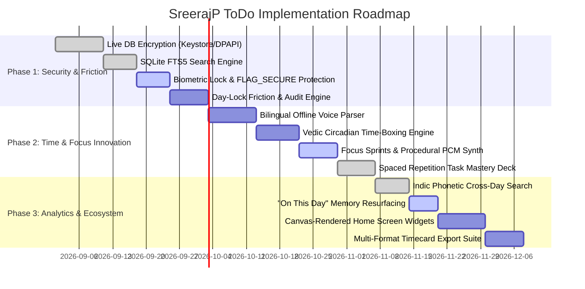

# SreerajP ToDo — Unique Features & Architectural Improvements Specification

## 1. Executive Summary & Ecosystem Context

**SreerajP ToDo** is a personal, fully offline, privacy-first daily ToDo and time-tracking application built with Flutter (`3.44.8 stable`) and Dart (`3.12.2`) for Android and Windows desktop platforms. It provides daily task organization, live multi-task concurrent time tracking, day-locked historical immutability, iCalendar RFC 5545 task recurrence, cross-day search, productivity analytics, and passphrase-encrypted backup archives.

This document presents an exhaustive architectural analysis of **truly unique productivity features** as well as **offline-first data management, sync, backup, restore, and transfer engines** for `SreerajP ToDo`. 

Following a comprehensive audit of all 18 applications in the user's suite documented in [myapps.md](file:///L:/Android/MyFlutterApps/myapps.md), this specification details how proven code assets, algorithms, crypto pipelines, procedural audio engines, and synchronization protocols across the 18 apps are adapted for `SreerajP ToDo` while strictly maintaining a 100% offline operational guarantee.

All proposed features and enhancements strictly observe the core architectural invariants of `SreerajP ToDo`:

1. **100% Offline Operational Guarantee:** Zero network permissions in `AndroidManifest.xml`, zero external cloud SDKs, zero analytics, zero telemetry.
2. **NFC Normalization First:** Every text string written to SQLite is NFC-normalized via `unicodeUtils.nfcNormalize(value)`.
3. **Day-Lock Constraint:** Historical tasks dated before today remain immutable read-only records (`DayLockedException`).
4. **Terminal Status Lock:** `completed` and `dropped` tasks cannot accept new time segments (`CompletedLockException`).
5. **Single Open Segment Limit:** At most one open time segment per task (`SegmentAlreadyRunningException`).
6. **Title Uniqueness Per Day:** NFC-normalized title uniqueness per date (`DuplicateTitleException`).

---

## 2. Comprehensive 18-App Code & Asset Reuse Matrix

By auditing all 18 applications in `L:\Android\MyFlutterApps\myapps.md`, we identify existing, production-tested algorithms, engines, crypto pipelines, and layout techniques that can be adapted for `SreerajP ToDo` without reinventing complex logic from scratch:

| # | Source Application | audited `features.md` Asset / Engine | Reusable Component / Algorithm for `SreerajP ToDo` |
|---|--------------------|--------------------------------------|----------------------------------------------------|
| 1 | **`chronotune-smart-clock`** | Offline Voice Command Parser (`en-IN` & `ml-IN`), Cognitive Challenges (Math, Sequence Memory, Phrase Typing), 16-Bit PCM Synth (`AudioEngine`), Canvas-rendered widgets. | **Bilingual Voice Task Parser**, **Anti-Procrastination Cognitive Friction Guard**, **Zero-Asset Procedural Audio Synth**, and **Canvas Home Screen Widgets**. |
| 2 | **`daily_rule_cards`** | Serene Parchment Theme, 18-iteration Binary Search Text Scaling (`_RuleCardMetrics.resolve`), 3-mode Control Bar Reflowing. | **Daily Mindful Intention Card Header** and **Viewport-Adaptive Card Reflowing Engine**. |
| 3 | **`MantraJapaCounter`** | 108-bead mala progress tracking, Sankalpa/Vow lifetime goal engine, native DTMF audio beep & pulse vibration, 2-tier persistence. | **Spaced Repetition Task Mastery Deck**, **Mala-Style Progress Sub-Goal Ring**, and **Native Haptic/Audio Feedback**. |
| 4 | **`Sanathana_Dharma_Clock`** | NOAA Solar & Jean Meeus Lunar Algorithms, 60 Ghaṭikā Vedic timekeeping (*Ahorātra* model), 30 Muhūrtas, 24 Horās, Solar Almanac. | **Vedic Circadian Time-Boxing Engine** (mapping task time-tracking to natural local sunrise, Ghaṭikās, and Muhūrtas). |
| 5 | **`sms-sentry`** | Offline Weighted Classification Rules, OTP regex, Bank transaction parser, exact `AlarmManager` due alerts, P2P LAN sync over AES-256-GCM. | **Exact Due-Date Alarm Scheduler**, **Contextual Text Field Extraction Engine**, and **Serverless P2P Wi-Fi Sync Engine**. |
| 6 | **`sreeraj_qr_reader`** | 6-Layer URL Safety Check, Zero-Trust Sandboxed Preview, Quishing Guard, StegoQR (AES-256 hidden payload), AirQR optical stream. | **AirQR Optical Animated QR Code Sync**, **Quishing Tamper Protection** for task QR attachments, and **StegoQR Task Payload Encryption**. |
| 7 | **`SreerajP_Authenticator`** | Hardware Keystore AES-256-GCM Vault, App PIN & Biometric Lock, `FLAG_SECURE` window protection, P2P LAN & Air-Gap sync. | **Biometric / PIN Task Lock**, **Screenshot/Screen-Recorder Shielding (`FLAG_SECURE`)**, **Recovery Key Engine**, and **P2P LAN / Air-Gap Sync**. |
| 8 | **`SreerajP_CodeApp`** | SAF Scoped Storage, Atomic File Saver (`AtomicSaver`), Draft Recovery (`DraftStore`), Virtualized Streaming (>50MB Degraded Mode), TTS Reader. | **Atomic SQLite/File Backup Writes**, **Crash Draft Recovery**, and **Multilingual Code/Text Task Reader**. |
| 9 | **`SreerajP_Devi`** | 3D Y-Axis Card Flipping (`FlippingCard`), Procedural Pushpanjali parabolic flight physics, Multi-Script Devanagari/Malayalam/English typography. | **3D Flipping Task Detail Cards** and **Devotional Intention Completion Animation**. |
| 10 | **`SreerajP_Journal_Vault`** | Drift SQLite ORM, AES-256-GCM Attachment Crypto, SQLite FTS5 (`entries_fts`), Task Revision History (`EntryRevisions`), Backlink Engine (`[[Title]]`), "On This Day" memory resurfacing, Backup Health Log. | **SQLite FTS5 Search Engine**, **Task Revision Audit Trail (`TodoRevisions`)**, **Inter-Task Backlink Engine**, **"On This Day" Memory Resurfacing**, and **Backup Health Dashboard (`BackupLogsDao`)**. |
| 11 | **`SreerajP_LalithaSahasranamam`** | Isar NoSQL DB, 3D Flip Cards, 3 Interpretation Levels, Spaced Repetition (Anki SM-2: Hard/Revision/Easy), Indic Grapheme-Cluster Line Wrapping. | **Spaced Repetition Habit Deck** and **Indic Complex Script Grapheme Line Wrapping**. |
| 12 | **`SreerajP_lyricchord`** | ChordPro parser, Semitone Transposition, Dual Auto-Scroll, Stage HUD Gesture Controls, PCM Synth Click Metronome, Shruti Box Drone (Sa-Pa, Sa-Ma). | **Procedural Focus Audio Drone**, **Stage Focus HUD Gesture Controls**, and **Pacing Metronome for Time-Boxing**. |
| 13 | **`SreerajP_PDFApp`** | pdfrx rendering, PdfBox-Android, Digital Signature Verification, Indic Phonetic & Sandhi Search (NFC, Chillu unification, ZWJ/ZWNJ stripping, Cantillation stripping). | **Indic Phonetic & Sandhi-Aware Cross-Day Task Search** and **PDF Productivity Report Compilation**. |
| 14 | **`SreerajP_TextApp`** | re_editor, CSV 2D Grid, JSON/XML Tree & Query Builders, JSON/XML Quick Fixes, P2P LAN Sync, Export PDF/DOCX/XLSX/ZIP. | **Multi-Format Structured Export & Ingestion Suite** (CSV timesheets, Markdown summaries, XLSX billing grids, JSON backups). |
| 15 | **`sreerajp_todo`** | Baseline 5-Layer Architecture, Day-Lock, Terminal Status Lock, Single Open Segment, NFC Normalization, iCalendar RRULE, fl_chart analytics. | **Current Application Codebase** being enhanced with unique capabilities. |
| 16 | **`sreerajp_youtube_shortcut`** | YouTube launcher shortcuts, Feed-free access, 7 theme palettes, QR generator & camera scanner. | **Feed-Free Focus Launcher** linking research tasks directly to specific YouTube video/playlist shortcuts and **QR Payload Generator**. |
| 17 | **`SreerajPContactSphere`** | Default dialer, T9 multi-script dialpad, Relationship Sphere & Scoring, Relationship Quiet Hours, Smart Redial exact alarms, Ephemeral self-destructing contacts, Audit log with hash chain verification, ICE card, Online Provider Sync. | **Tamper-Evident Task Audit Log with Hash Chain Verification**, **Ephemeral Self-Destructing Scratch Tasks**, **Task Relationship Sphere**, and **Local Desktop/Server Sync Adapter**. |
| 18 | **`vault-files`** | Storage Analyzer, File Manager, AES-256-GCM Secure Notes, Shielded Folders. | **Shielded Task Folders** and **Encrypted Attachment Storage**. |

---

## 3. Detailed Feature & Data Management Specifications

**Status legend used in this section and in section 4:**

| Mark | Meaning |
|------|---------|
| ✅ **Implemented** | Built, shipped, and working in the current codebase. |
| 🟡 **Partly implemented** | The main part is built. A named piece is still missing, listed under **Not Included**. |
| *(no mark)* | Planned only. No code for it yet. |

### 3.1 Day-Locked Time-Travel Friction Engine & Deferral Audit Trail
- **Concept:** Traditional todo apps allow users to endlessly change dates, defer, or push tasks into the future without consequence. `SreerajP ToDo` enforces an immutable past (Day-Lock). This feature introduces intentional cognitive friction and a tamper-evident audit log whenever a user attempts to repeatedly defer (`port`) a task.
- **Functionality:**
  - If a task has been ported $\ge 3$ times across different dates, attempting to port it again triggers the **Time-Travel Friction Engine**.
  - Presents an interactive modal requiring the user to choose one of two breakdown paths:
    1. **Deconstruct Task:** Break the task into 2 or more smaller sub-tasks (e.g. 10-minute actionable steps) before deferral is permitted.
    2. **Cognitive Intent Challenge:** Complete a 15-second cognitive friction challenge (adapted from `chronotune-smart-clock` math/sequence memory/phrase retyping challenges) to verify mental intent before deferring.
  - Maintains a persistent `TodoRevisions` SQLite table (reused from `SreerajP_Journal_Vault` `EntryRevisions`) recording an immutable audit trail with SHA-256 hash chain verification (adapted from `SreerajPContactSphere`) detailing every date modification, deferral reason, and title edit over time.
- **Why Unique:** No Android todo app enforces cognitive friction challenges or tamper-evident hash-chained audit trails on deferred tasks.

### 3.2 Bilingual Offline Natural Language Voice Task Parser (`en-IN` & `ml-IN`) ✅
- **Status:** Implemented ✅
- **Current Implementation:**
  - **Parser (`lib/core/voice/`):** `VoiceCommandParser` is pure Dart with no grammar file, no model and no network. It walks a sentence four times — duration, time of day, date, priority — removing the words it understands, and whatever is left becomes the title. Every word it knows lives in `voice_lexicon_en.dart` and `voice_lexicon_ml.dart`, so the engine itself holds rules and no vocabulary.
  - **Malayalam by stem, not by word:** Malayalam glues its case endings on, so `ഏഴര` turns up as `ഏഴരയ്ക്ക്`. The Malayalam lexicon stores stems and the parser matches the start of a token, then swallows the whole token. Longer stems always win, so `പത്തൊൻപത` (19) beats `പത്ത` (10). Half-hour forms (`ഒന്നര` … `പന്ത്രണ്ടര`), `പത്തു മണിക്ക്`, `45 മിനിറ്റ്`, `അടുത്ത തിങ്കളാഴ്ച` and `മറ്റന്നാൾ` all work, glued or spaced.
  - **Both lexicons always run,** so a mixed sentence such as `Call അമ്മ നാളെ for 20 minutes` needs no language switch.
  - **It never invents.** No date words means today. An hour with no `am`, `pm` or part-of-day word is kept exactly as said. A day already past is clamped to today, because Day-Lock makes past days read-only.
  - **Sheet (`VoiceCommandSheet`):** a small microphone FAB above the add FAB on the day list opens a floating sheet with a language toggle, a microphone button, a text box, and chips showing what was understood. It never saves: it opens the ordinary create screen with the fields filled in, so Day-Lock, title uniqueness and NFC normalisation stay enforced in the one place they always were. `unicodeUtils.nfcNormalize()` runs on the input before matching and on the title after; `detectTextDirection()` drives the text box and the chips.
  - **Speech-to-text (`SpeechChannel` + `MainActivity`):** a small method channel over Android `SpeechRecognizer`, not a package, so the audited dependency list is unchanged. The on-device engine is always asked for (`createOnDeviceSpeechRecognizer` on API 33+, `EXTRA_PREFER_OFFLINE` below it) and listening is refused rather than allowed to go online. Adds `RECORD_AUDIO`, and nothing else; **no network permission is added.**
  - **Off by default:** Settings → Task defaults → Day list → Voice input. A fresh install shows no microphone button and never asks for the microphone.
- **Not a Package:** typing works everywhere, including Windows and any phone with no offline language pack. The parser is identical either way; voice input only adds the microphone.
- **Why Unique:** All existing Android todo apps (Todoist, TickTick, Any.do) require online Google Voice Typing, Siri, or cloud NLP servers. This operates 100% offline with full Malayalam language equity.

### 3.3 Vedic Circadian Time-Boxing & Elastic Ghaṭikā Productivity Mode
- **Concept:** An optional productivity mode that aligns daily task time-tracking with local solar astronomical cycles (*Ahorātra* model) and traditional Vedic time units.
- **Functionality:**
  - Uses on-device NOAA solar position algorithms (adapted from `Sanathana_Dharma_Clock`) to calculate precise daily local sunrise and sunset without network calls.
  - Divides today's daylight and night hours into 60 elastic *Ghaṭikā* units (~24 civil minutes each) and 30 named *Muhūrtas* (~48 civil minutes each).
  - Displays a Vedic circadian progress ring on the Daily List showing active *Muhūrta* (e.g. *Brahma Muhūrta* for early morning planning, *Abhijit Muhūrta* for peak task execution, and *Rāhu Kālam* warning badges during inauspicious windows).
  - Allows time tracking in standard civil minutes (`HH:MM:SS`) or elastic *Ghaṭikā* focus blocks.
- **Why Unique:** No todo application on any platform integrates solar-anchored circadian timekeeping or elastic *Ghaṭikā* focus tracking.

### 3.4 Multi-Task Concurrent Focus Sprints with Zero-Asset Procedural Audio Synth 🟡
- **Status:** Partly implemented 🟡
- **Current Implementation:**
  - **Pomodoro Sprint Engine (`PomodoroNotifier`):** Runs a work / short-break / long-break cycle beside the live timer. Tracked time is only ever recorded during a work block, so breaks never inflate a task's total. The notifier holds the running block, the owning task, the block end time, and the count of finished work blocks.
  - **Sprint Settings Page:** Settings → Time tracking → Pomodoro (`/settings/time-tracking/pomodoro`) sets the work length, the short and long break lengths, and how many work blocks come before a long break.
  - **Focus Pulse Nudge (`FocusPulseNotifier` & `focus_pulse_rules.dart`):** An optional vibration and/or short chime every 5 to 120 minutes while a timer runs (default 30, off by default). Modes are `off`, `vibration`, `sound`, `both`. Pulses are worked out from the clock rather than counted up, so the schedule never drifts, and they stay quiet while Pomodoro is on.
  - **Full-Screen Focus View:** `/focus/:id` pairs the sprint with large typography, the sub-task checklist, and the `FocusPulseRing` animation (see 4.6).
- **Not Included:** the zero-asset 16-bit PCM procedural synth. The nudge currently uses `HapticFeedback` and `SystemSound` from the Flutter engine, which keeps the audited dependency list unchanged and bundles no audio file, but it does not produce the ADSR-enveloped arpeggiated chimes described below. In-app only — nothing sounds while the app is closed.
- **Concept:** Pair multi-task concurrent live time tracking with structured Pomodoro focus sprints (25m / 50m) and real-time procedurally synthesized audio chimes.
- **Functionality:**
  - When starting a timer, users can toggle "Standard Tracking" or "Focus Sprint".
  - Plays gentle, ADSR-enveloped arpeggiated audio chimes and periodic haptic/audio ticks generated in real time using 16-bit PCM stereo procedural synthesis (reused from `chronotune-smart-clock` and `SreerajP_lyricchord` `PcmSynthService`).
  - Operates with zero bundled MP3 audio assets, eliminating app bloat while producing pure, clips-free harmonic audio for sprint starts, 15-minute milestones, and break intervals.
- **Why Unique:** Other apps rely on bundled MP3 files or cloud streams; `SreerajP ToDo` generates pure stereo synthesizer audio dynamically in Dart code.

### 3.5 Spaced Repetition Task Mastery Deck (Anki-Style Habit & Skill Engine) ✅
- **Status:** Implemented ✅
- **Current Implementation:**
  - **Database Migration V6:** Created table `spaced_repetition_items` (`id`, `title`, `description`, `level`, `ease_factor`, `interval_days`, `next_review_date`, `last_reviewed_at`, `active`, `created_at`, `updated_at`) and added foreign key column `spaced_repetition_item_id` to `todos`.
  - **SM-2 Adaptive Algorithm:** Completing a mastery task calculates next review due dates based on recall feedback:
    - **Hard:** Reset interval to 1 day (level 1).
    - **Revision:** Maintain interval at 3 days.
    - **Easy:** Expand interval exponentially ($7 \times \text{level}$ days).
  - **Recall Confidence Dialog:** Intercepts completion of tasks tagged `#mastery` / `#spaced-repetition` or linked to SRS items with a modal presenting **Hard**, **Revision**, and **Easy** choices.
  - **Mastery Deck View:** Dedicated screen (`/mastery-deck`) integrated into navigation bar and rail for creating, viewing, and managing deck items.
- **Concept:** Transform recurring maintenance, study, or skill-building tasks into an Anki-style Spaced Repetition Task Deck.
- **Functionality:**
  - Tasks tagged as `#mastery` or `#spaced-repetition` do not follow rigid calendar dates. Instead, completing a task presents three recall confidence buttons (adapted from `SreerajP_LalithaSahasranamam` and `MantraJapaCounter` vow tracking).
  - Automatically calculates `nextReviewDue` using an SM-2 spaced repetition algorithm and generates the task on the Daily List on the exact target review date.
- **Why Unique:** Spaced repetition algorithms are exclusive to flashcard apps (Anki, RemNote). Integrating SM-2 spaced repetition directly into a daily todo & time-tracking workflow is completely novel.

### 3.6 Indic Phonetic & Sandhi-Aware Cross-Day Task Search ✅
- **Status:** Implemented ✅
- **Current Implementation:**
  - **Database Migration V8:** Added a `notes TEXT` column to `time_segments`, and rebuilt the FTS5 virtual table `todos_fts` as (`todo_id UNINDEXED`, `title`, `description`, `notes`). Every indexed column stores search-folded text.
  - **Tokenizer Fix:** The table now uses `unicode61 remove_diacritics 2 categories 'L* N* Co Mn Mc'`. The previous plain `unicode61` tokenizer treated every Malayalam vowel sign and virama as a word break, indexing `കാര്യം` as the separate letters `ക`, `ര`, `യ`; whole Malayalam words are now indexed as single tokens. Falls back to the plain tokenizer on an older SQLite build.
  - **Folding Engine (`lib/core/utils/indic_search_utils.dart`):** `foldForSearch` is applied to both the stored text and the typed query. It NFC-normalizes, unifies Chillu (`ണ`+virama+ZWJ → `ൺ`, `ന` → `ൻ`, `ര` → `ർ`, `ല` → `ൽ`, `ള` → `ൾ`, `ക` → `ൿ`), strips `ZWJ`/`ZWNJ`, strips Latin accent marks only (Malayalam vowel signs and virama are preserved), lower-cases, and collapses whitespace. Folding walks grapheme clusters via the `characters` package.
  - **Index Maintenance:** Because SQL cannot call the Dart folding function, insert and update sync moved from SQL triggers into `TodoSearchIndexDao`, driven by `TodoDao` and `TimeSegmentDao`. The delete trigger remains in SQL as a safety net.
  - **Segment Notes:** Notes can be added on the manual segment sheet and edited from each row of the time segments screen. `TodoDao.searchWithMatchedNotes` returns the original note text that explains a hit, which the search results screen shows as the row subtitle.
  - **Not Included:** Cross-script phonetic transliteration (typing Latin `ka` to find `ക`). The referenced `SreerajP_PDFApp` engine was not available in this repository.
- **Concept:** High-performance, cross-day search across titles, descriptions, and segment notes supporting Indic Unicode scripts, Chillu character unification, and accent stripping.
- **Functionality:**
  - Combines SQLite FTS5 virtual tables (`todos_fts` adapted from `SreerajP_Journal_Vault`) with the Indic phonetic search engine from `SreerajP_PDFApp`.
  - Unifies Malayalam Chillu sequences (`ണ`+virama+ZWJ $\rightarrow$ `ൺ`, `ന`+virama+ZWJ $\rightarrow$ `ൻ`, `ര`+virama+ZWJ $\rightarrow$ `ർ`, `ല`+virama+ZWJ $\rightarrow$ `ൽ`, `ള`+virama+ZWJ $\rightarrow$ `ൾ`), strips zero-width joiners (`ZWJ`/`ZWNJ`), and performs grapheme-cluster-aligned matching via the `characters` package.
  - Enables sub-millisecond full-text search across thousands of historical tasks regardless of script representation.
- **Why Unique:** Standard todo search engines fail on Indic scripts due to ZWJ joiner mismatches and un-normalized Chillu characters.

### 3.7 "On This Day" Productivity Memory Flashbacks & Evening Reflection Ritual 🟡
- **Status:** Partly implemented 🟡
- **Current Implementation:**
  - **Database Migration V5:** Created tables `daily_reflections` (`date` PK, `reflection_note`, `completed_seconds`, `dropped_seconds`, `created_at`, `updated_at`) and `daily_intentions` (`date` PK, `intention_text`, `created_at`).
  - **Evening Reflection Ritual (`EveningReflectionModal`):** A modal on the day list that summarises today's completed versus dropped tracked time and records a free-text reflection note. Text is NFC-normalized before it is written. Past days open read-only, respecting Day-Lock.
  - **Morning Intention Card (`MorningIntentionCard`):** The expandable header card above today's list holds the day's intention text and opens the reflection modal (see also 4.3).
  - **Data Layer:** `DailyReflectionDao`, `DailyReflectionRepository` / `DailyReflectionRepositoryImpl`, and Riverpod providers in `lib/application/providers.dart`.
- **Not Included:** the "On This Day" memory flashback card. Nothing yet resurfaces tasks completed 100 days, 6 months, or 1 year ago on the same calendar day.
- **Concept:** Resurface major milestones accomplished on the same calendar day in previous months or years, paired with an evening reflection ritual.
- **Functionality:**
  - **Memory Flashback Card:** Prominently highlights tasks completed on this exact month and day 1 year, 6 months, or 100 days ago (reusing the memory resurfacing engine from `SreerajP_Journal_Vault`), displaying total time spent and completion tags.
  - **Evening Reflection Ritual:** An optional 60-second evening reflection modal (adapted from `daily_rule_cards` and `SreerajP_Journal_Vault` mood/reflection engine) summarizing today's completed vs. dropped time ratio and recording a 1-5 scale mood/reflection note stored in SQLite.
- **Why Unique:** Existing todo apps dump completed tasks into dark archives; resurfacing productivity memories fosters long-term motivation and intentional reflection.

### 3.8 Biometric & Hardware Keystore Task Vault with `FLAG_SECURE` Privacy Protection 🟡
- **Status:** Partly implemented 🟡
- **Current Implementation:**
  - **App Lock Modes (`app_lock_rules.dart`, `AppLockNotifier`):** The whole app can be locked with `off`, `pin` (digits only), `password` (free text), or `deviceCredential` — the phone's own unlock screen, which uses fingerprint or face where the user set that up. Configured at Settings → Security → App lock (`/settings/security/app-lock`).
  - **Auto-Lock Delay:** How long the app may sit in the background before it locks again — immediately, 30 seconds, 1 minute, 5 minutes, 15 minutes, or never. Even `never` still locks on a cold start. Configured at `/settings/security/auto-lock`.
  - **Wrong-Try Slow-Down:** Repeated wrong PIN or password entries add a growing wait before the next try, handled by pure rules in `core/` so it stays unit testable.
  - **Native `FLAG_SECURE` (`AppLockChannel` & `MainActivity.kt`):** A small platform channel (`in.sreerajp.todo/app_lock`) sets Android's `FLAG_SECURE`, so screenshots, screen recording, and the recent-apps preview are all blocked. A channel is used instead of a package so the audited dependency list stays unchanged. It is a safe no-op on Windows.
  - **Database Key Screen:** `/settings/security/database-key` surfaces the at-rest encryption state described in 4.1.
- **Not Included:** the per-task vault. Tasks tagged `#private` are not yet hidden from the main Daily List behind a separate unlock, and there is no encrypted attachment store. Today the lock is all-or-nothing for the whole app.
- **Concept:** Protect sensitive personal, client, or financial tasks behind hardware-backed security and screen capture prevention.
- **Functionality:**
  - Adapts `local_auth` biometric authentication, hardware Keystore 6-digit PIN lock, and native `FLAG_SECURE` window protection (from `SreerajP_Journal_Vault`, `SreerajP_Authenticator`, and `vault-files`).
  - Tasks flagged as `#private` are hidden from the main Daily List until unlocked via biometric/PIN verification.
  - Native `FLAG_SECURE` prevents system screenshots, screen recording, and task-switcher thumbnail caching on Android.
  - Task reference notes and attachments are stored encrypted at rest with hardware Keystore-wrapped AES-256-GCM.
- **Why Unique:** Todo apps expose all tasks openly on screen. This provides military-grade device security and screen-recording protection for private tasks.

### 3.9 Canvas-Rendered Dynamic Home Screen & Lock Screen Complication Widgets
- **Concept:** View active timers, daily progress rings, and current *Muhūrta* focus badges directly from the device home screen.
- **Functionality:**
  - Native Android `Canvas` widget rendering engine (adapted from `chronotune-smart-clock`, `Sanathana_Dharma_Clock`, and `SreerajP_LalithaSahasranamam`).
  - Renders a multi-ring completion graphic (completed vs working vs pending), active task title, elapsed timer countdown, and 1-tap ▶ Start / ⏹ Stop quick-action buttons.
  - Driven by non-wakeup `AlarmManager` ticks (`ELAPSED_REALTIME`), ensuring zero battery drain during Doze mode.
- **Why Unique:** Offers interactive multi-timer controls and custom vector progress rings rendered natively on the home screen without battery drain.

### 3.10 Multi-Format Professional Timecard & Audit Export Suite
- **Concept:** Convert tracked time segments and task history into professional, client-ready PDF timecards, CSV timesheets, and Markdown summaries.
- **Functionality:**
  - **PDF Daily/Weekly Timecard:** Generates clean, printable PDF reports containing task titles, status summaries, exact interval tables, and total billable durations (reusing PDF layout patterns from `SreerajPContactSphere`, `SreerajP_PDFApp`, and `SreerajP_lyricchord`).
  - **CSV Timesheet Export:** Exports granular `TimeSegmentEntity` data to `.csv` with ISO timestamps, task titles, manual/auto tags, and duration seconds (reusing export patterns from `SreerajP_TextApp`).
  - **Markdown Summary:** Formats structured Markdown (`- [x] Task (01:15:00)`) copyable to clipboard or saved as `.md`.
  - **Signed Audit Log Export:** Exports a tamper-evident audit log signed with SHA-256 hash chains (reused from `SreerajPContactSphere`).
- **Why Unique:** Transforms raw tracked time into formatted, billable, client-ready invoices and tamper-proof audit records fully offline.

### 3.11 Passphrase-Encrypted Backup & Automated Health Restore System ✅
- **Status:** Implemented ✅
- **Current Implementation:**
  - **Passphrase Encryption:** Exports complete SQLite database state (`todos`, `time_segments`, `recurrence_rules`, `spaced_repetition_items`, `todo_revisions`, `backup_logs`) into a single passphrase-encrypted archive (`sreerajp_todo_backup_YYYYMMDD_HHMMSS.db.aes`) using PBKDF2-HMAC-SHA256 (300,000 iterations) key derivation and AES encryption (`CryptoUtils`). Full import compatibility maintained for legacy `.db` archives.
  - **Automated Health Dashboard:** Background scheduled backup creator with a visual health log dashboard (`BackupHealthDashboard` & `BackupLogsDao` via Migration V7), displaying past execution status (`success`, `failed`), file sizes, trigger types (`manual`, `scheduled`), and diagnostic logs.
  - **Atomic Safe Import/Restore:** Validates archive passphrase, schema version compatibility (runs migrations for older versions, rejects newer versions via `BackupVersionTooNewException`), verifies SQLite integrity (`PRAGMA integrity_check`), and atomically replaces the live database using `AtomicSaver` with staging and fail-safe rollback capability.
- **Concept:** Encrypted backup generation, automated background scheduling, and diagnostic health logging for data protection.
- **Functionality:**
  - **Passphrase Encryption:** Exports complete SQLite database state (`todos`, `time_segments`, `recurrence_rules`, `spaced_repetition_items`, `todo_revisions`) into a single passphrase-encrypted ZIP archive (`sreerajp_todo_backup_YYYYMMDD_HHMMSS.db.aes`) using PBKDF2-HMAC-SHA256 (300,000 iterations) key derivation and AES-256-GCM encryption (adapted from `SreerajP_Journal_Vault` and `SreerajP_Authenticator`).
  - **Automated Health Dashboard:** Background scheduled backup creator with a visual health log dashboard (`BackupLogsDao` adapted from `SreerajP_Journal_Vault`), displaying past execution status (`success`, `failed`), file sizes, and diagnostic logs.
  - **Atomic Safe Import/Restore:** Validates archive passphrase, schema version compatibility (runs migrations for older versions, rejects newer versions via `BackupVersionTooNewException`), verifies SQLite integrity (`PRAGMA integrity_check`), and atomically replaces the live database using `AtomicSaver` (adapted from `SreerajP_CodeApp` and `SreerajP_TextApp`).

### 3.12 Multi-Format Data Ingestion & Export Engine (JSON with Markdown) ✅
- **Status:** Implemented ✅
- **Current Implementation:**
  - **Structured JSON Data Handoff (`DataHandoffPayload` & `DataHandoffService`):** Ingests and exports task lists, subtask checklists, recurrence rules, time segment records, and embedded Markdown styles via system file pickers (`FilePicker.platform.pickFiles` / `saveFile`). Handles schema versioning, sanitized bounds, and NFC normalization (`nfcNormalize`).
  - **Markdown Checklist Ingestion & Export:** Imports external `.md` files or raw Markdown text containing `- [ ]` and `- [x]` checklist items and nested subtasks, converting them into `TodoEntity` instances on the target date. Exports formatted Markdown checklist documents and timecard summaries.
  - **Interactive Markdown Paste Modal (`MarkdownImportDialog`):** Provides a live preview sheet showing parsed task count, completion status, and subtasks before merging into local SQLite storage.
  - **Day-Lock Enforcement:** Enforces past-day immutability (`DayLockedException`), preventing ingestion onto past dates.

### 3.13 AirQR Optical Air-Gapped Animated QR Code Sync ✅
- **Status:** Implemented ✅
- **Current Implementation:**
  - **Fountain Code Streaming Engine (`AirQrService`):** Implements Luby Transform (LT1) Fountain codes with systematic v1 direct frames and LT1 XOR parity frames, CRC32 checksum validation, and real-time streaming frame reduction (belief propagation decoding over GF(2)).
  - **Animated Stream Sender (`AirQrShareDialog`):** Displays animated QR code stream with customizable frame rates (5 FPS, 10 FPS, 15 FPS, 20 FPS, 25 FPS), play/pause controls, frame sequence metadata, and high-density QR encoding using `qr_flutter`.
  - **Camera Stream Receiver (`AirQrScanScreen`):** Live camera barcode scanner powered by `mobile_scanner`, displaying a real-time stream decoding progress overlay (progress percentage, block count ratio, live FPS counter, torch button).
  - **Interactive Preview & Merge Sheet (`AirQrPreviewSheet`):** Parses reassembled payloads (`AirQrPayloadService`), presents an interactive preview sheet for tasks/timecards/backups, and merges tasks safely into local SQLite storage with conflict duplicate handling.
  - **Air-Gapped Isolation:** Operates with complete air-gap isolation—zero network packets transmitted over Wi-Fi, Cellular, or Bluetooth.
- **Concept:** Serverless, air-gapped data transfer between two nearby phones using screen-to-camera optical QR code streams without Wi-Fi, Bluetooth, or internet connections.

### 3.14 Serverless Encrypted Local P2P Wi-Fi Sync Engine ✅
- **Status:** Implemented ✅
- **Current Implementation:**
  - **Serverless Local TCP Transport (`P2pWifiSyncService`):** Host device opens a temporary TCP socket on a random local port (`ServerSocket.bind`), discovering non-loopback IPv4 addresses and listening for peer client TCP socket connections.
  - **High-Entropy Session Encryption (`P2pWifiSyncCrypto`):** Session handshake establishes AES-256 CTR + HMAC-SHA256 authenticated payload encryption with 256-bit keys derived via PBKDF2-HMAC-SHA256 (300,000 iterations) from an out-of-band 6-digit numeric pairing PIN or scannable pairing QR code (`wifi_sync://<ip>:<port>?pin=<pin>&salt=<salt_hex>`).
  - **Connect-Then-Choose Workflow (`P2pWifiSyncScreen`):** Peer connects to host via IP, port, and PIN, then interactively requests sync scope (**Full Sync** or selective categories: **Today's Tasks**, **Time Segments**, **Recurrence Rules**, **Mastery Deck**).
  - **Add-Only Non-Destructive Merge:** Merges incoming records based on natural primary keys (`date` + NFC-normalized `title`) without overwriting existing local data or violating past-day Day-Lock constraints.
  - **Hardened Security & Bounds:** Enforces strict memory caps (`maxTodos = 10,000`, `maxFieldLen = 4KB`, 30s handshake timeout, 120s host idle auto-stop server) to prevent DoS or memory exhaustion.
- **Concept:** Direct device-to-device task and timecard synchronization across local Wi-Fi / hotspot connections without cloud servers or third-party backends.

### 3.15 Local Self-Hosted Desktop & Local Server Sync Adapter
- **Concept:** 100% offline, local-network sync adapter enabling Windows desktop and Android instances of `SreerajP ToDo` to discover, pair, and synchronize task states over local subnets.
- **Functionality:**
  - **Local Subnet Pairing:** Discovers and pairs Windows desktop (`flutter run -d windows`) and Android instances of `SreerajP ToDo` over the local subnet without external web servers or BaaS cloud accounts (adapted from `SreerajPContactSphere` local sync adapter and `SreerajP_TextApp` P2P engine).
  - **Biometric / PIN Gated Sync:** Opening sync on either desktop or mobile requires passing local biometric/PIN authentication.
  - **Deterministic Conflict Resolution:** Resolves concurrent edits using vector clocks (`SyncMetadata` adapted from `SreerajP_Journal_Vault`). Conflicting task states trigger a side-by-side visual conflict resolution dialog (Keep Local, Keep Remote, Merge).

---

## 4. Enhancements for Already Implemented Features

### 4.1 Live Database Encryption at Rest (Android Keystore / Windows DPAPI) ✅
- **Status:** Implemented ✅
- **Current Implementation:**
  - Mobile (Android): Derived transparent 256-bit database encryption key stored inside hardware Android Keystore (`AndroidKeyStore` master key). Passed when opening `sqflite_sqlcipher`.
  - Desktop (Windows): Utilized Windows DPAPI (`CryptProtectData` / `CryptUnprotectData`) via FFI to protect the SQLite database key.
  - Transparent Auto-Rekeying: Automatically migrates unencrypted existing databases in-place via `PRAGMA rekey`.

### 4.2 Full-Text Search Engine Upgrade (SQLite FTS5 Virtual Tables) ✅
- **Status:** Implemented ✅
- **Current Implementation:**
  - Implemented SQLite FTS5 virtual table (`todos_fts`) adapted from `SreerajP_Journal_Vault`, giving instant, tokenized full-text search across titles and descriptions.
  - **Later superseded by Migration V8 (see 3.6).** The table was rebuilt as (`todo_id UNINDEXED`, `title`, `description`, `notes`) with the `unicode61 remove_diacritics 2 categories 'L* N* Co Mn Mc'` tokenizer, because the plain `unicode61` tokenizer broke Malayalam words apart at every vowel sign and virama.
  - **Index maintenance moved out of SQL.** The insert and update triggers were replaced by `TodoSearchIndexDao`, driven from `TodoDao` and `TimeSegmentDao`, because SQL cannot call the Dart search-folding function. Only the delete trigger remains in SQL, as a safety net.

### 4.3 Daily Mindful Intention Card & Reflection Ritual ✅
- **Status:** Implemented ✅
- **Current Implementation:**
  - Expandable header card docked above today's list (reusing UI patterns from `daily_rule_cards`) presenting daily focus rules and morning cues.

### 4.4 Hierarchical Sub-task Checklists & Inter-task Dependency Engine ✅
- **Status:** Implemented ✅
- **Current Implementation:**
  - Embeds sub-task checklist items (`[ ] Step 1`, `[x] Step 2`) inside `TodoEntity` with mini progress pills on task tiles, paired with prerequisite task dependency links.

### 4.5 In-App Language Override (English / Malayalam / System Default) ✅
- **Status:** Implemented ✅
- **Current Implementation:**
  - Explicit language selection menu in Settings (`System Default`, `English`, `Malayalam`) persisted via `SharedPreferences` and Riverpod `localeProvider`.

### 4.6 Timer Engine Audio & Visual Enhancements (Full-Screen Focus UI, Haptic & Procedural Ticks) ✅
- **Status:** Implemented ✅
- **Current Implementation:**
  - **Full-Screen Focus Mode:** Tapping the time chip on a task tile (or the focus button on the Time Segments screen) opens `FocusScreen` at `/focus/:id`: large typography on a dark ground, the active task title and description, the tickable sub-task checklist, and an ambient `FocusPulseRing` animation that fills to the task target when one is set. The view keeps the user's accent colour and font, hides the system bars when "Immersive full screen" is on, and returns to the day list when the timer is stopped.
  - **Procedural Haptic & Audio Pulse:** `FocusPulseNotifier` gives an optional vibration and/or short chime every 5 to 120 minutes (default 30) while a timer runs, set in Settings → Time tracking → Focus mode. The nudge uses `HapticFeedback` and `SystemSound` from the Flutter engine, so no audio file is bundled and no package was added. Pulses are counted from the start of the running segment and worked out from the clock, so the schedule never drifts, and they stay quiet while Pomodoro is on.
  - **Known limit:** in-app only. The app sends no notifications, so nothing sounds while it is closed or in the background; a nudge that fell due while away is dropped rather than replayed. Tracked time is unaffected.

### 4.7 Recurrence Engine (RRULE) Visual Heatmaps & Holiday Calendar Sync
- **Planned Enhancement:**
  - **Visual Calendar Heatmap:** Replaces 5-date text list with an interactive mini calendar grid (`table_calendar`) highlighting projected occurrence dates up to 3 months ahead.
  - **Holiday Calendar Awareness:** Integrates holiday calendar import (reused from `chronotune-smart-clock` `SpecialDayRegistry`), supporting rules like `SKIP_HOLIDAYS` or `MOVE_TO_NEXT_WORKDAY`.

### 4.8 Advanced Productivity Analytics (Focus Distribution, Efficiency Scores, Completion Streaks)
- **Status:** Planned. Today the Statistics screen (`/statistics`) has a daily bar chart, a per-item line chart, and matching daily and per-item tables. None of the three items below exist yet.
- **Planned Enhancement:**
  - **Focus Time Distribution:** Hourly heatmap chart showing peak productive hours.
  - **Productivity Efficiency Score:** Algorithmic ratio measuring planned vs. completed vs. dropped/ported tasks over rolling 7-day and 30-day windows.
  - **Daily Completion Streaks:** Streak counter tracking consecutive days with completed tasks (reused from `SreerajP_Journal_Vault`).

---

## 5. Compliance & Architectural Verification Guarantee

All proposed unique features and enhancements strictly comply with the architectural rules established in `AGENTS.md` and `docs/architecture.md`:

```text
+-----------------------------------------------------------------------------------+
|                            ARCHITECTURAL GUARANTEES                              |
+-----------------------------------------------------------------------------------+
| 1. Fully Offline Guarantee: Zero network calls; zero INTERNET permission.        |
| 2. NFC Normalization: unicodeUtils.nfcNormalize() on all text write paths.        |
| 3. Day-Lock Immutability: Past-day tasks remain read-only (DayLockedException).   |
| 4. Terminal Status Lock: No new segments on completed/dropped tasks.              |
| 5. Concurrency Control: Single open time segment per task.                        |
| 6. Clean 5-Layer Architecture: Presentation -> Application -> Domain -> Data.      |
| 7. Centralized Strings: All user strings housed in app_strings.dart & ARB files.  |
+-----------------------------------------------------------------------------------+
```

---

## 6. Phased Implementation Roadmap & Prioritization Matrix

Implementation is structured into three sequential phases:



### Phase 1: Security, Audit & Friction Foundation
- Live Database Encryption at Rest (Android Keystore / Windows DPAPI) ✅
- SQLite FTS5 Full-Text Search Engine Upgrade ✅
- Biometric & Hardware Keystore Task Vault with `FLAG_SECURE` Privacy Protection 🟡 (app-wide lock and `FLAG_SECURE` done; per-task `#private` vault pending)
- Day-Locked Time-Travel Friction Engine & Deferral Audit Trail

### Phase 2: Deep Time & Focus Innovation
- Bilingual Offline Natural Language Voice Task Parser (`en-IN` & `ml-IN`)
- Vedic Circadian Time-Boxing & Elastic Ghaṭikā Productivity Mode
- Multi-Task Concurrent Focus Sprints with Zero-Asset Procedural Audio Synth 🟡 (Pomodoro sprints and focus pulse done; PCM synth pending)
- Spaced Repetition Task Mastery Deck (Anki-Style Habit & Skill Engine) ✅

### Phase 3: Advanced Search, Analytics & Ecosystem Integration
- Indic Phonetic & Sandhi-Aware Cross-Day Task Search ✅
- "On This Day" Productivity Memory Flashbacks & Evening Reflection Ritual 🟡 (morning intention and evening reflection done; flashback card pending)
- Canvas-Rendered Dynamic Home Screen & Lock Screen Complication Widgets
- Multi-Format Professional Timecard & Audit Export Suite
- AirQR Optical Air-Gapped Animated QR Code Sync ✅
- Serverless Encrypted Local P2P Wi-Fi Sync Engine ✅
- Local Self-Hosted Desktop & Local Server Sync Adapter

---

## 7. Implementation Status Summary

One place to see where every feature stands. Last checked against the codebase on 2026-08-19.

| # | Feature | Status | Notes |
|---|---------|--------|-------|
| 3.1 | Day-Locked Time-Travel Friction Engine & Deferral Audit Trail | Planned | No `todo_revisions` table, no hash chain, no friction modal. |
| 3.2 | Bilingual Offline Voice Task Parser (`en-IN` / `ml-IN`) | ✅ Done | `VoiceCommandParser`, both lexicons, `VoiceCommandSheet`, on-device `SpeechChannel`. Off by default. |
| 3.3 | Vedic Circadian Time-Boxing & Elastic Ghaṭikā Mode | Planned | No solar algorithms in the codebase. |
| 3.4 | Focus Sprints with Zero-Asset Procedural Audio Synth | 🟡 Partly | Pomodoro engine and focus pulse done; PCM synth pending. |
| 3.5 | Spaced Repetition Task Mastery Deck | ✅ Done | Migration V6, SM-2 engine, `/mastery-deck`. |
| 3.6 | Indic Phonetic & Sandhi-Aware Cross-Day Search | ✅ Done | Migration V8, FTS5 with Indic tokenizer, segment notes. Cross-script transliteration not included. |
| 3.7 | "On This Day" Flashbacks & Evening Reflection Ritual | 🟡 Partly | Migration V5, intention card and reflection modal done; flashback card pending. |
| 3.8 | Biometric Task Vault with `FLAG_SECURE` | 🟡 Partly | App-wide lock, auto-lock and `FLAG_SECURE` done; per-task `#private` vault pending. |
| 3.9 | Canvas-Rendered Home / Lock Screen Widgets | Planned | No Android widget provider. |
| 3.10 | Multi-Format Timecard & Audit Export Suite | Planned | JSON and Markdown handoff exists (3.12), but no PDF, CSV, or signed audit export. |
| 3.11 | Passphrase-Encrypted Backup & Health Restore | ✅ Done | Migration V7, `BackupLogsDao`, atomic restore. |
| 3.12 | Multi-Format Data Ingestion & Export (JSON + Markdown) | ✅ Done | `DataHandoffService`, `MarkdownImportDialog`. |
| 3.13 | AirQR Optical Air-Gapped Animated QR Sync | ✅ Done | `AirQrService` fountain codes, sender, scanner, merge sheet. |
| 3.14 | Serverless Encrypted Local P2P Wi-Fi Sync | ✅ Done | `P2pWifiSyncService`, PIN pairing, add-only merge. |
| 3.15 | Local Desktop / Server Sync Adapter | Planned | No subnet discovery or vector-clock conflict resolution. |
| 4.1 | Live Database Encryption at Rest | ✅ Done | Android Keystore and Windows DPAPI. |
| 4.2 | Full-Text Search Engine Upgrade (FTS5) | ✅ Done | Superseded and improved by Migration V8, see 3.6. |
| 4.3 | Daily Mindful Intention Card | ✅ Done | Expandable header card on the day list. |
| 4.4 | Sub-task Checklists & Dependency Engine | ✅ Done | Checklist items with progress pills. |
| 4.5 | In-App Language Override | ✅ Done | System / English / Malayalam. |
| 4.6 | Timer Audio & Visual Enhancements | ✅ Done | `/focus/:id`, `FocusPulseRing`, haptic and chime pulses. |
| 4.7 | Recurrence Heatmaps & Holiday Calendar | Planned | `rrule_preview.dart` still shows a text list of dates. |
| 4.8 | Advanced Productivity Analytics | Planned | Statistics screen has charts and tables only; no streaks, heatmap, or efficiency score. |

**Count:** 13 done ✅, 3 partly done 🟡, 7 planned.
